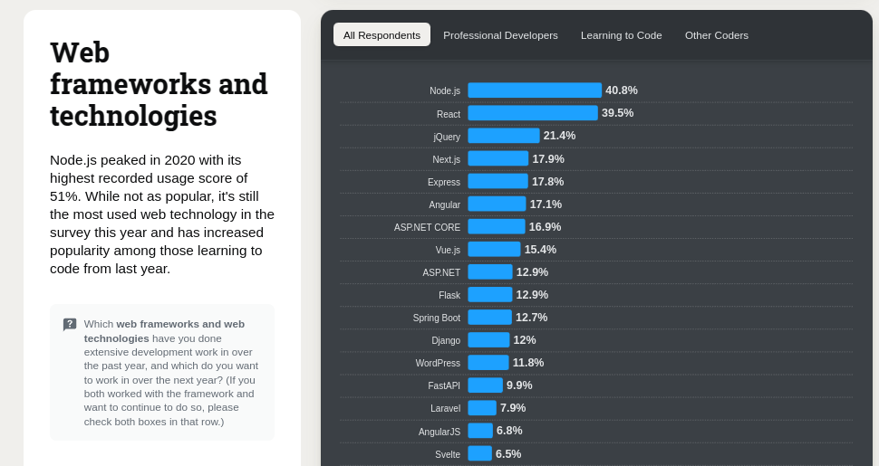

# การติดตั้งเครื่องมือและแนะนำเกี่ยวกับการพัฒนาเว็บแอปพลิเคชัน

## <span style="color: orange;">ติดตั้งเครื่องมือ</span>

### Download และติดตั้งตามลิงค์ต่อไปนี้
* [Node.js](https://nodejs.org/en/download/)  (ควรใช้ LTS version ตั้งแต่ 18 ขึ้นไป)
* [Visual Studio Code](https://code.visualstudio.com/download)

### การทดสอบหลังติดตั้งเสร็จ

หลังจากที่คุณติดตั้ง Node.js เสร็จเรียบร้อยแล้ว คุณสามารถทดสอบการติดตั้งได้ดังนี้:

1. เปิด Terminal หรือ Command prompt
2. รันคำสั่งต่อไปนี้เพื่อตรวจสอบเวอร์ชันของ Node.js:
    ```sh
    node -v
    ```
3. รันคำสั่งต่อไปนี้เพื่อตรวจสอบเวอร์ชันของ npm:
    ```sh
    npm -v
    ```
4. รันคำสั่งต่อไปนี้เพื่อตรวจสอบว่า npx ทำงานได้ถูกต้อง:
    ```sh
    npx -v
    ```

หากคำสั่งทั้งหมดแสดงเวอร์ชันที่ถูกต้อง แสดงว่าการติดตั้งเสร็จสมบูรณ์และพร้อมใช้งาน

## <span style="color: orange;">Extensions ใน VSCode ที่ควรติดตั้ง</span>

* <span style="color: lightblue;">**JavaScript (ES6) code snippets**</span> by *charalampos karypidis*
* <span style="color: lightblue;">**ES7+ React/Redux/GraphQL/React-Native snippets**</span> by *dsznajder*
* <span style="color: lightblue;">**React-Native/React/Redux snippets for es6/es7**</span> by *EQuimper*
* <span style="color: lightblue;">**Color Picker**</span> by *anseki*
* <span style="color: lightblue;">**Color Highlight**</span> by *Sergii N*
* <span style="color: lightblue;">**AutoFileName**</span> by *JerryHong*
* <span style="color: lightblue;">**Auto Import - ES6, TS, JSX, TSX**</span> by *Sergey Korenuk*
* <span style="color: lightblue;">**Tailwind CSS IntelliSense**</span> by *Tailwind Labs* 
* <span style="color: lightblue;">**Prettier - Code formatter**</span> by *Prettier* 
* <span style="color: lightblue;">**Thunder Client**</span> by *Thunder Client* 
* <span style="color: lightblue;">**Rest Client**</span> by *Huachao Mao* 
* <span style="color: lightblue;">**CodeSnap**</span> by *adpyke* 

## <span style="color: orange;">Full Stack Web Development</span>
Full Stack Web Development คือการพัฒนาเว็บที่ครอบคลุมทั้งส่วน Front-end และ Back-end โดยนักพัฒนา Full Stack จะต้องมีความรู้และทักษะในการทำงานทั้งสองส่วนนี้


<sup>ภาพประกอบ : https://jethrojeff.com</sup>

### Front-end
Front-end คือส่วนที่ผู้ใช้สามารถมองเห็นและโต้ตอบได้บนเว็บเบราว์เซอร์ โดยใช้เทคโนโลยีหลักๆ ดังนี้:
* <span style="color: lightblue;">**HTML**</span> (HyperText Markup Language) - ใช้สำหรับสร้างโครงสร้างของหน้าเว็บ
* <span style="color: lightblue;">**CSS**</span> (Cascading Style Sheets) - ใช้สำหรับตกแต่งและจัดรูปแบบหน้าเว็บ
* <span style="color: lightblue;">**JavaScript**</span> - ใช้สำหรับเพิ่มความสามารถในการโต้ตอบและการทำงานของหน้าเว็บ

ตัวอย่าง Framework ที่นิยมใช้ใน Front-end:
* <span style="color: lightblue;">**React**</span> - พัฒนาโดย Facebook ใช้สำหรับสร้าง UI ที่มีประสิทธิภาพและสามารถนำกลับมาใช้ใหม่ได้
* <span style="color: lightblue;">**Angular**</span> - พัฒนาโดย Google เป็น Framework ที่มีความสามารถครบถ้วนสำหรับการพัฒนาเว็บแอปพลิเคชัน
* <span style="color: lightblue;">**Vue**</span> - เป็น Framework ที่มีขนาดเล็กและง่ายต่อการเรียนรู้ เหมาะสำหรับการพัฒนาเว็บแอปพลิเคชันที่มีความซับซ้อนน้อยถึงปานกลาง

### Back-end
Back-end คือส่วนที่ทำงานอยู่เบื้องหลังและจัดการกับการประมวลผลข้อมูลและการเชื่อมต่อกับฐานข้อมูล โดยใช้เทคโนโลยีหลักๆ ดังนี้:
* <span style="color: lightblue;">**Node.js**</span> - เป็น JavaScript runtime ที่ทำงานบนฝั่งเซิร์ฟเวอร์ ใช้สำหรับสร้างแอปพลิเคชันที่มีประสิทธิภาพสูง
* <span style="color: lightblue;">**Express.js**</span> - เป็น Framework สำหรับ Node.js ที่ช่วยในการจัดการเส้นทางและการทำงานของ REST API
* <span style="color: lightblue;">**Django**</span> - เป็น Framework สำหรับภาษา Python ที่มีความสามารถครบถ้วนและใช้งานง่าย
* <span style="color: lightblue;">**Ruby on Rails**</span> - เป็น Framework สำหรับภาษา Ruby ที่เน้นการพัฒนาอย่างรวดเร็วและมีโครงสร้างที่ชัดเจน


<sup>ภาพประกอบ : https://www.altexsoft.com</sup>

### REST API
REST (Representational State Transfer) API คือรูปแบบการออกแบบ API ที่ใช้ HTTP ในการสื่อสารระหว่าง Client และ Server โดยมีหลักการดังนี้:
* <span style="color: lightblue;">**Stateless**</span> - แต่ละคำขอ (request) จาก Client ไปยัง Server จะต้องมีข้อมูลที่เพียงพอในการประมวลผล โดยไม่ต้องอ้างอิงถึงคำขออื่นๆ
* <span style="color: lightblue;">**Resource-based**</span> - ทุกๆ สิ่งที่สามารถเข้าถึงได้ผ่าน API จะถูกมองว่าเป็น Resource และสามารถระบุได้ด้วย URL
* <span style="color: lightblue;">**HTTP Methods**</span> - ใช้ HTTP methods เช่น GET, POST, PUT, DELETE ในการดำเนินการกับ Resource

ตัวอย่างการทำงานของ REST API:
* <span style="color: lightblue;">**GET /users**</span> - ดึงข้อมูลผู้ใช้ทั้งหมด
* <span style="color: lightblue;">**POST /users**</span> - สร้างผู้ใช้ใหม่
* <span style="color: lightblue;">**PUT /users/1**</span> - อัปเดตข้อมูลผู้ใช้ที่มี ID เป็น 1
* <span style="color: lightblue;">**DELETE /users/1**</span> - ลบผู้ใช้ที่มี ID เป็น 1


<sup>ภาพประกอบ : https://mannhowie.com/rest-api</sup>

การทำงานของ API สามารถรองรับการเรียกใช้งานจากหลายๆ แหล่งข้อมูลได้ และสามารถทำงานได้เสมอไม่ว่าจะเป็นการเรียกใช้งานจาก Web Mobile อุปกรณ์ IoT ฯลฯ


<sup>ภาพประกอบ : https://cours-info.iut-bm.univ-fcomte.fr</sup>

ทดลองเล่น API ได้ที่ [JSON Placeholder](https://jsonplaceholder.typicode.com/)

### ตัวอย่าง Full Stack
ปัจจุบันมี Stack ที่นิยมใช้ในการพัฒนา Full Stack Web Development ดังนี้:
* <span style="color: lightblue;">**MEAN Stack**</span> - ประกอบด้วย MongoDB Express.js Angular และ Node.js


* <span style="color: lightblue;">**MERN Stack**</span> - ประกอบด้วย MongoDB Express.js React และ Node.js

ในปัจจุบัน MERN Stack ได้รับความนิยมมากขึ้นเนื่องจาก React มีความยืดหยุ่นและประสิทธิภาพสูงในการพัฒนา UI

การพัฒนา Full Stack Web Development ต้องการความเข้าใจในทุกส่วนของการพัฒนาเว็บและการทำงานร่วมกันของเทคโนโลยีต่างๆ เพื่อสร้างเว็บแอปพลิเคชันที่มีประสิทธิภาพและตอบสนองความต้องการของผู้ใช้

### Web Framework 2024
จากผลการสำรวจของ Stack Overflow ในปี 2024 พบว่า React ยังคงเป็น Web Framework ที่ได้รับความนิยมในระดับต้น ๆ และมีแนวโน้มที่จะเพิ่มขึ้นในอนาคต


<sup>ภาพประกอบ : https://survey.stackoverflow.co/2024/technology</sup>

ข้อมูลเพิ่มเติม: 
* [สถิติการใช้ Angular รายเดือนของ GitHub](https://github.com/angular/angular/pulse/monthly)
* [สถิติการใช้ React รายเดือนของ GitHub](https://github.com/facebook/react/pulse/monthly)
* [สถิติการใช้ Vue รายเดือนของ GitHub](https://github.com/vuejs/core/pulse/monthly)


### อ้างอิง
* [Node.js](https://nodejs.org/en/download/)
* [Visual Studio Code](https://code.visualstudio.com/download)
* [React](https://reactjs.org/)
* [Angular](https://angular.io/)
* [Vue.js](https://vuejs.org/)
* [Node.js](https://nodejs.org/)
* [Express.js](https://expressjs.com/)
* [Django](https://www.djangoproject.com/)
* [Ruby on Rails](https://rubyonrails.org/)
* [REST API](https://restfulapi.net/)
* [MEAN Stack](https://www.mongodb.com/mean-stack)
* [MERN Stack](https://www.mongodb.com/mern-stack)