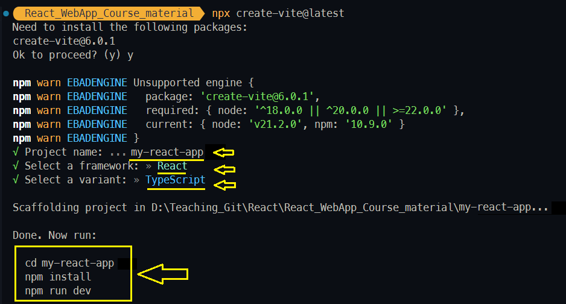
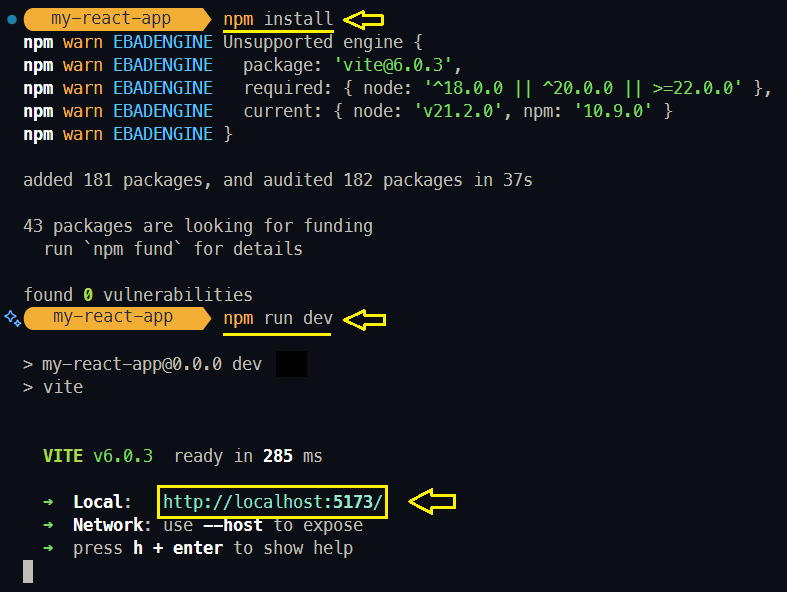
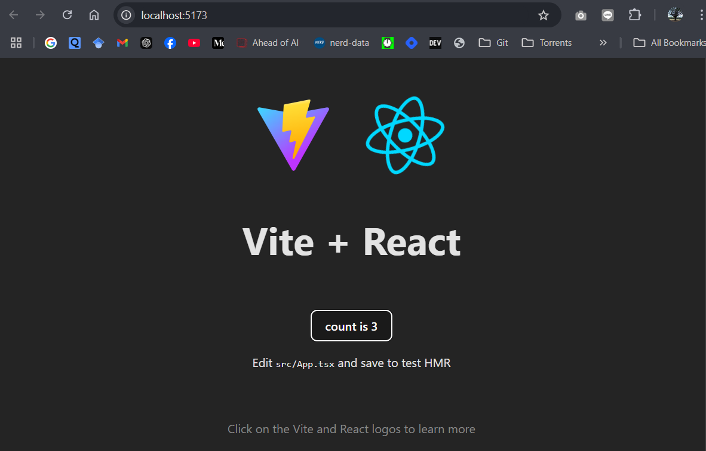
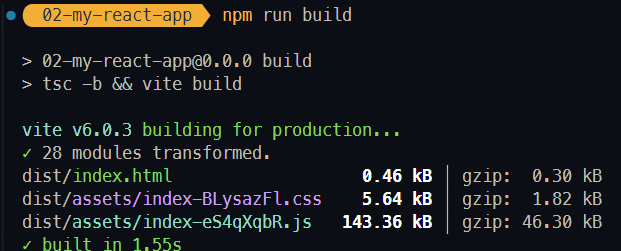
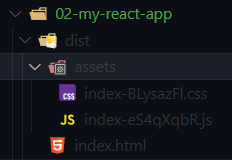
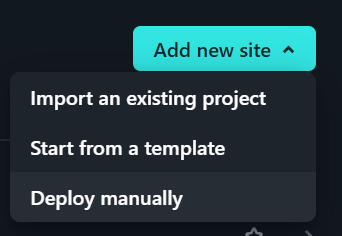
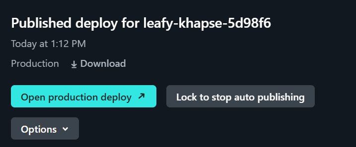
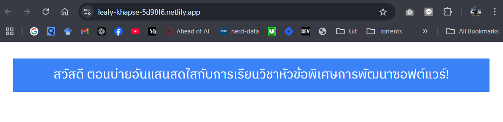

# Intro to React

## ขั้นตอนในการสร้างโปรเจกต์ React

1. **สร้างโปรเจกต์ด้วย Vite**: Vite เป็นเครื่องมือที่ใช้สร้างโปรเจกต์ JavaScript และทำให้การพัฒนาแอปพลิเคชันเป็นไปได้อย่างรวดเร็ว โดยการ Build และ Hot Reload ที่มีประสิทธิภาพสูง เหมาะสำหรับการพัฒนา React, Vue, และ Svelte โดยเฉพาะ สามารถดูข้อมูลเพิ่มเติมเกี่ยวกับ Vite ได้ที่ [Vite Documentation](https://vitejs.dev/guide/)

   การสร้างโปรเจ็ค React สามารถสร้างโปรเจกต์ได้หลายวิธี ในตัวอย่างนี้จะใช้การสร้างโปรเจ็ค React ด้วย Vite ผ่าน npx โดยใช้คำสั่ง **create-vite** โดยสามารถระบุ Template ที่ต้องการใช้ได้ ในตัวอย่างข้างล่างนี้ใช้ Template react-ts ซึ่งเป็น Template สำหรับสร้างโปรเจ็ค React ที่ใช้ TypeScript ในการพัฒนา

   ```bash
   npx create-vite@latest my-react-app --template react-ts
   ```

    หากไม่ต้องการกำหนด Template สามารถใช้คำสั่งดังนี้:

    ```bash
    npx create-vite@latest
    ```
    หากต้องการสร้างโปรเจ็ค React ที่ใช้ TypeScript สามารถกำหนดดังภาพประกอบต่อไปนี้

    

   วิธีนี้ไม่จำเป็นต้องติดตั้งแพ็กเกจล่วงหน้า ใช้ npx สำหรับการรันคำสั่งที่ต้องการเพียงครั้งเดียว ทำให้ประหยัดพื้นที่ในเครื่อง  

   <sup><ins>ข้อมูลเพิ่มเติม</ins></sup>

   <sup>- **npm** คือ Node Package Manager ที่ใช้สำหรับการจัดการแพ็กเกจในโปรเจ็ค Node.js โดยสามารถใช้คำสั่ง npm ในการติดตั้งแพ็กเกจ สร้างโปรเจ็ค และจัดการแพ็กเกจต่าง ๆ ได้ [แหล่งอ้างอิง: npm Documentation](https://docs.npmjs.com/) </sup>

   <sup>- **npx** คือ Node Package Runner ที่ใช้สำหรับการรันคำสั่งที่อยู่ในแพ็กเกจที่ไม่ได้ติดตั้งในเครื่อง โดย npx จะช่วยให้คุณรันคำสั่งที่อยู่ในแพ็กเกจที่ไม่ได้ติดตั้งในเครื่อง โดยไม่ต้องติดตั้งแพ็กเกจล่วงหน้า [แหล่งอ้างอิง: npx Documentation](https://docs.npmjs.com/cli/v7/commands/npx) </sup>

   เมื่อสร้างโปรเจ็คเรียบร้อยแล้วในภาพประกอบจะเห็นว่าเราสามารถเข้าไปยังกล่องโปรเจ็คและรันโปรเจ็คผ่านคำสั่งในตอนท้ายของภาพตัวอย่างได้ โดยเริ่มจากการเข้าไปยังกล่องโปรเจ็คโดยใช้คำสั่

    ```bash
    cd my-react-app
    ```
    และติดตั้ง Dependencies พร้อมรันโปนเจ็คในขั้นตอนที่ 2 และ 3 ต่อไป
   
2. **ติดตั้ง Dependencies**:  
  
   1) เข้าไปที่โฟลเดอร์โปรเจกต์แล้วติดตั้ง Dependencies ที่จำเป็น:

   ```bash
   npm install
   ```

3. **เริ่มต้นรันโปรเจ็คในโหมดสำหรับพัฒนา**:  
   รันเโปรเจ็คเพื่อดูผลลัพธ์:

   ```bash
   npm run dev
   ```

      ตัวอย่างผลลัพธ์ที่จากขั้นตอนที่ 2-3:
        


4. **เปิดโปรเจกต์ในเบราว์เซอร์**:  
   เปิดเบราว์เซอร์แล้วไปที่ URL ที่แสดงใน Terminal (ปกติจะเป็น `http://localhost:5173`)

    


## โครงสร้างของโปรเจกต์ React (Vite + TypeScript)

หลังจากสร้างโปรเจกต์แล้ว โครงสร้างของโฟลเดอร์จะมีลักษณะดังนี้:

```
my-react-app/
├── node_modules/
├── public/
│   └── vite.svg
├── src/
│   ├── assets/
│   │   └── [ไฟล์ Static เช่น รูปภาพ]
│   ├── components/
│   │   └── [ส่วนประกอบ React ที่สามารถใช้ซ้ำได้]
│   ├── App.tsx
│   ├── main.tsx
│   └── index.css
├── .gitignore
├── package.json
├── tsconfig.json
├── vite.config.ts
└── README.md
```

### โฟลเดอร์และไฟล์สำคัญ

- **`src/`**:  
  รวมโค้ดทั้งหมดของแอปพลิเคชัน

  - **`App.tsx`**: ไฟล์ Root Component ของแอป
  - **`main.tsx`**: จุดเริ่มต้นสำหรับการเรนเดอร์แอปเข้าสู่ DOM
  - **`components/`**: โฟลเดอร์สำหรับเก็บส่วนประกอบ (Component) ที่สามารถใช้ซ้ำได้
  - **`assets/`**: โฟลเดอร์สำหรับไฟล์ Static เช่น รูปภาพ
  - **`index.css`**: ไฟล์สำหรับ CSS ทั่วไปของแอป

- **`public/`**:  
  เก็บไฟล์ Static ที่ Vite จะไม่ทำการประมวลผล เช่น ไฟล์ HTML หรือรูปภาพ

- **`tsconfig.json`**:  
  ไฟล์การตั้งค่าของ TypeScript สำหรับโปรเจ็ค โดยจะถูกสร้างขึ้นโดยเมื่อสร้างโปรเจ็คด้วย Vite โดยมีการตั้งค่าพื้นฐานสำหรับโปรเจ็ค React อยู่แล้ว

- **`vite.config.ts`**:  
  ไฟล์การตั้งค่าของ Vite เช่น การกำหนด path ของ src ด้วย @ โดยต้องติดตั้ง path ก่อนใช้งานโดยใช้คำสั่ง `npm install path` หรือ `npm install @types/node` และเพิ่ม path ในไฟล์ vite.config.ts ดังนี้
  
  ```ts
  import { defineConfig } from 'vite';

  export default defineConfig({
    resolve: {
      alias: {
        '@': path.resolve(__dirname, '/src'),
      },
    },
  });
  ```
  เพื่อให้สามารถใช้ @ ในการ Import ไฟล์ในโฟลเดอร์ src ได้ เช่น `import App from '@/App'`

  สำหรับโปรเจ็ค TypeScript จำเป็นต้องแก้ไขไฟล์ tsconfig.json ให้เป็นดังนี้:

  ```json
  {
    "compilerOptions": {
      "target": "esnext",
      "module": "esnext",
      "jsx": "react-jsx",
      "strict": true,
      "esModuleInterop": true,
      "lib": ["dom", "dom.iterable", "esnext"],
      "allowJs": true,
      "skipLibCheck": true,
      "skipDefaultLibCheck": true,
      "forceConsistentCasingInFileNames": true,
      "noEmit": true,
      "isolatedModules": true,
      "moduleResolution": "node",
      "resolveJsonModule": true,
      "jsxImportSource": "react",
      "baseUrl": "./src"
    },
    "include": ["src"]
  }
  ```

- **`node_modules/`**:  
  โฟลเดอร์ที่เก็บ Dependencies ของโปรเจกต์ โดยจะถูกสร้างขึ้นโดยเมื่อติดตั้ง Dependencies ด้วยคำสั่ง `npm install` (มีขนาดใหญ่และไม่จำเป็นต้องเก็บไว้เพียงแค่ติดตั้งใหม่หลัง Clone Repository)

- **`package.json`**:  
  ไฟล์ที่เก็บข้อมูลของโปรเจกต์ รวมถึง Dependencies และ Scripts ต่าง ๆ ในการ Build และ Run โปรเจ็ค ตัวอย่าง:

  ```json
  {
    "name": "my-react-app",
    "version": "0.0.1",
    "scripts": {
      "dev": "vite",
      "build": "vite build"
    },
    "dependencies": {
      "react": "^17.0.2",
      "react-dom": "^17.0.2"
    },
    "devDependencies": {
      "@vitejs/plugin-react": "^1.0.0",
      "vite": "^2.6.4"
    }
  }
  ```
  * **scripts** เป็นส่วนที่เก็บคำสั่งที่ใช้ในการรัน การติดตั้ง และการทดสอบโปรเจ็ค จากตัวอย่างข้างบน มีคำสั่งที่สำคัญดังนี้:
    - **`dev`**: คำสั่งที่ใช้ในการรันโปรเจ็คในโหมด Development
    - **`build`**: คำสั่งที่ใช้ในการ Build โปรเจ็คสำหรับ Production
  
  * **dependencies** เป็นส่วนที่เก็บ Dependencies ที่ใช้ใน Production ในตัวอย่างข้างบน มี Dependencies สำคัญดังนี้:
    - **`react`**: ไลบรารีสำหรับสร้าง User Interface (UI)
    - **`react-dom`**: ไลบรารีสำหรับจัดการ DOM ใน React

  * **devDependencies** เป็นส่วนที่เก็บ Dependencies ที่ใช้ใน Development devDependencies สำคัญดังนี้:
    - **`@vitejs/plugin-react`**: Plugin สำหรับใช้ React กับ Vite
    - **`vite`**: Vite เป็นเครื่องมือสำหรับ Build โปรเจ็ค React


- **`.gitignore`**:
  ไฟล์ที่ระบุไฟล์หรือโฟลเดอร์ที่ไม่ต้องการให้ Git ติดตาม หรือเก็บไว้ใน Repository ตัวอย่างการเขียน .gitignore ดังนี้:

  ```
  # Node modules
  node_modules/

  # Vite build output
  dist/
  .vite/

  # Cache directories
  .cache/

  # Logs
  npm-debug.log*
  yarn-debug.log*
  yarn-error.log*

  # Editor directories and files
  .vscode/
  .idea/
  *.suo
  *.ntvs*
  *.njsproj
  *.sln

  # OS generated files
  .DS_Store
  Thumbs.db

  # .env files (หากมีการแชร์เป็น Pulbic Repository ควรเพิ่ม .env ใน .gitignore)
  .env

  # TypeScript specific
  *.tsbuildinfo
  ```

  **Note**: ใน index.html จะปรากฏ div ที่มี id คือ root ดังนี้
  
  ```html
  <body>
    <div id="root"></div>
    <script type="module" src="/src/main.tsx"></script>
  </body>
  ```

   ในไฟล์ main.tsx มีการเรียกใช้ Component หลักของโปรเจ็ค (App ใน App.tsx) เพื่อทำการ Render ลงใน DOM (หรือ div ที่ id ชื่อ root) จากโค้ด 
  
  ```tsx  
  import App from '@/App'

  createRoot(document.getElementById('root')!).render(
    <StrictMode>
      <App />
    </StrictMode>,
  )
  ```
  ซึ่งแสดงให้เห็นการทำงานแบบ Single Page Application (SPA) นั้นคือรูปแบบของแอปพลิเคชันเว็บที่ทำงานโดยโหลดหน้าเว็บเพียงครั้งเดียวและจัดการการเปลี่ยนแปลงเนื้อหาในหน้าโดยไม่ต้องโหลดหน้าเว็บใหม่ทั้งหมดจากเซิร์ฟเวอร์อีกครั้ง 
  ([การทำงานของ SPA ใน React](02_1_SPA_React.md))

### การติดตั้ง tailwindcss ในโปรเจ็ค React

ที่มา: [Install Tailwind CSS with Vite](https://tailwindcss.com/docs/guides/vite)

 1) ติดตั้ง tailwindcss และ postcss โดยใช้คำสั่งดังนี้:
    ```bash
    npm install -D tailwindcss postcss autoprefixer
    npx tailwindcss init -p
    ```
  2) สร้างไฟล์ tailwind.config.js โดยกำหนดดังนี้:
      ```js
      /** @type {import('tailwindcss').Config} */
      module.exports = {
        content: [
          "./src/**/*.{js,jsx,ts,tsx}",
        ],
        theme: {
          extend: {},
        },
        plugins: [],
      };
      ```

  3) แก้ไขไฟล์ index.css ให้เป็นดังนี้:
      ```css
      @tailwind base;
      @tailwind components;
      @tailwind utilities;
      ```
  4) ทดสอบการใช้ tailwind โดยแก้ไข App.tsx เป็นดังนี้
      ```tsx
      import React from 'react';

      const App = () => {
        return (
          <div className="bg-blue-500 text-white p-4">
            <h1 className="text-2xl">Hello, Tailwind CSS!</h1>
          </div>
        );
      };

      export default App;
      ```

### การติดตั้ง font ภาษาไทย ผ่าน Google Font

1) ไปที่ [Google Fonts](https://fonts.google.com/) และเลือก Font ที่ต้องการใช้
2) เลือกตัวกรองภาษาไทย (Thai) และเลือก Font ที่ต้องการใช้
3) คัดลอก Code ที่ใช้ในการเรียกใช้ Font และวางในไฟล์ index.css ดังนี้:
    ```css
    @import url('https://fonts.googleapis.com/css2?family=IBM+Plex+Sans+Thai:wght@100;200;300;400;500;600;700&display=swap');
    ```

    หรือเพิ่มเป็น link ในไฟล์ index.html ดังนี้:
    ```html
    <link href="https://fonts.googleapis.com/css2?family=IBM+Plex+Sans+Thai:wght@100;200;300;400;500;600;700&display=swap" rel="stylesheet">
    ```
    
4) ใช้ Font ในโปรเจ็คโดยเขียน CSS ในไฟล์ index.css ดังนี้:
    ```css
    body {
      font-family: "IBM Plex Sans Thai", sans-serif;
    }
    ```
5) ทดสอบการใช้ Font โดยแก้ไข App.tsx เป็นดังนี้:
    ```tsx
    import React from 'react';

    const App = () => {
      return (
        <div className="bg-blue-500 text-white p-4">
          <h1 className="text-2xl"> สวัสดี ตอนบ่ายอันแสนสดใสกับการเรียนวิชาหัวข้อพิเศษการพัฒนาซอฟต์แวร์!</h1>
        </div>
      );
    };

    export default App;
    ```
### การ Build และ Deploy โปรเจ็ค React (Vite + TypeScript)

1) **Build โปรเจ็ค**:  
   ใช้คำสั่ง `npm run build` เพื่อ Build โปรเจ็คสำหรับ Production:

   ```bash
   npm run build
   ```

    

        สังเกตว่าโปรเจ็คจะถูก Build ในโฟลเดอร์ `dist/` โดยมีไฟล์ที่ถูก Build อยู่ในโฟลเดอร์นี้ และสำหรับโปรเจ็ค TypeScript จะถูก Compile ให้เป็น JavaScript ก่อน Build โดยใช้คำสั่ง `tsc` ก่อน Build โปรเจ็ค

    

        จะเห็นว่าไฟล์ในกล่อง dist จะถูก Minify และ Optimize ให้มีขนาดเล็กลง สามารถนำไป Deploy ได้ทันที และเนื่องจากมีการ complie จาก TypeScript เป็น JavaScript จึงมีเพียงไฟล์ JavaScript ที่ถูก Build อยู่ในโฟลเดอร์นี้


2) **Deploy โปรเจ็ค บน Netlify**

    1) สร้าง Account หรือ Login ที่ [Netlify](https://www.netlify.com/)
    2) กดปุ่ม **Add new site** แล้วเลือก Deploy manually

        

    3) ลากโฟลเดอร์ `dist/` ที่ Build โปรเจ็คไปยังพื้นที่ที่ Netlify กำหนด

       

    4) เมื่อเสร็จแล้วสามารถเข้าไปดูเว็บไซต์โดยกดปุ่ม **Open production deploy** 

    
        

        ตัวอย่างเว็บที่ Deploy แล้วโดยใช้ Netlify และหลังจาก Deploy สำเร็จ สามารถเข้าไปดูผลลัพธ์ได้ที่ URL ที่ Netlify สร้างขึ้น

        

## หลักการทำงานสำคัญของ React

มีหลักการสำคัญที่นิยมใช้งานอย่างแพร่หลาย ดังนี้:

### 1. **Components**

- เป็นส่วนสำคัญของ React ที่ใช้ในการสร้าง UI
- สามารถเขียนเป็นฟังก์ชันหรือคลาสที่คืนค่า JSX (JavaScript XML)
- ตัวอย่าง:
  ```tsx
  const HelloWorld = () => {
    return <h1>สวัสดี โลก!</h1>;
  };
  ```

### 2. **JSX**

- รูปแบบการเขียนโค้ดที่ผสม HTML และ JavaScript/TypeScript
- ตัวอย่าง:
  ```tsx
  const App = () => <div>สวัสดี React!</div>;
  ```

### 3. **State**

- ใช้สำหรับเก็บข้อมูลที่เปลี่ยนแปลงได้ใน Component
- จัดการด้วย `useState` hook
- ตัวอย่าง:
  ```tsx
  const Counter = () => {
    const [count, setCount] = React.useState(0);
    return <button onClick={() => setCount(count + 1)}>Count: {count}</button>;
  };
  ```

### 4. **Props**

- ใช้สำหรับส่งข้อมูลจาก Parent Component ไปยัง Child Component
- ตัวอย่าง:

  ```tsx
  const Greeting = ({ name }: { name: string }) => <h1>สวัสดี, {name}!</h1>;

  function App() {
    return (
      <>
        <Greeting name="สมชาย" />
        <Greeting name="สมหญิง" />
      </>
    );
  }
  ```

### 5. **Lifecycle และ Effects**

- React มี Lifecycle ของ Component เช่น การ Mount Update และ Unmount
- `useEffect` ใช้จัดการ Side Effects เช่น การดึงข้อมูล
- ตัวอย่าง:
  ```tsx
  React.useEffect(() => {
    console.log("Component ถูก Mount!");
  }, []);
  ```

  [ข้อมูลเพิ่มเติม React Lifecycle and Effects](https://react.dev/learn/lifecycle-of-reactive-effects)
  

### 6. **Routing (การจัดการเส้นทาง)**

- React ไม่ได้มีระบบ Routing มาในตัว สามารถใช้ไลบรารี เช่น `react-router-dom` เพื่อสร้างการนำทาง [แหล่งอ้างอิง](https://reactrouter.com/)
- ตัวอย่าง:

  ```tsx
  import { BrowserRouter, Routes, Route } from "react-router-dom";

  const App = () => (
    <BrowserRouter>
      <Routes>
        <Route path="/" element={<Home />} />
        <Route path="/about" element={<About />} />
      </Routes>
    </BrowserRouter>
  );
  ```

### 7. **Context**

- ใช้สำหรับแชร์ข้อมูลระหว่าง Component โดยไม่ต้องส่งผ่าน Props
- ตัวอย่าง:

  ```tsx
  const ThemeContext = React.createContext("light");

  const App = () => (
    <ThemeContext.Provider value="dark">
      <Toolbar />
    </ThemeContext.Provider>
  );
  ```

## รูปแบบการใช้งานต่าง ๆ

### JSX จะมี Element เริ่มต้นที่เป็น Root Element เพียงตัวเดียว

```tsx
const App = () => <h1>Hello, World!</h1>;
```

แบบนี้จะไม่สามารถทำงานได้:

```tsx
const App = () => (
  <h1>Hello, World!</h1>
  <p>สวัสดี</p>
);
```

แก้โดย
  
  ```tsx
  const App = () => (
    <>
      <h1>Hello, World!</h1>
      <p>สวัสดี</p>
    </>
  );
  ```


### One-way binding
ใช้สำหรับแสดงข้อมูลจากตัวแปรใน Component ไปยัง JSX โดยใช้ `{}` ในการแทรกข้อมูล

```tsx
const App = () => {
  const message = "Hello, World!";
  return <h1>{message}</h1>;
};
```

### กำหนด class ให้กับ element ใน JSX
ใช้ `className` แทน `class` เพื่อกำหนด class ใน JSX

```tsx
const App = () => <div className="container">Hello, World!</div>;
```

กรณีต้องการกำหนดแบบ Dynamic class สามารถใช้ Template Literals ได้

```tsx
const App = () => {
  const isDarkMode = true;
  return <div className={`container ${isDarkMode ? "dark" : "light"}`}>Hello, World!</div>;
};
```

### การแสดงภาพ
ใช้ JSX ในการแสดงภาพโดยใช้ Element `` และกำหนด `src` ของภาพ และไฟล์ภาพความเก็บไว้ในโฟลเดอร์ `public/`

```tsx
const App = () => ;
```

กรณีแสดงภาพแบบ dynamic สามารถทำได้โดยกำหนดตัวแปรใน `src` ได้

```tsx
const App = () => {
  const logo = "logo.png";
  return ;
};
```


## TypeScript ใน React

TypeScript คือ ภาษาโปรแกรมที่เป็นซูเปอร์เซตของ JavaScript ที่มีการเพิ่ม Type System เข้ามา ทำให้การพัฒนาโค้ดสามารถตรวจสอบข้อผิดพลาดได้ตั้งแต่ตอนเขียนโค้ด ทำให้การเขียนโค้ดมีความมั่นใจมากขึ้น โดยเฉพาะในโครงการขนาดใหญ่

### TypeScript Vs. JavaScript


#### ความแตกต่างในการเขียนโค้ด

- **TypeScript**:

  เป็นซูเปอร์เซตของ JavaScript ที่มีการเพิ่ม Type System เข้ามา ทำให้การพัฒนาโค้ดสามารถตรวจสอบข้อผิดพลาดได้ตั้งแต่ตอนเขียนโค้ด ทำให้การเขียนโค้ดมีความมั่นใจมากขึ้น โดยเฉพาะในโครงการขนาดใหญ่ ตัวอย่างเช่น การประกาศตัวแปรจะต้องระบุชนิดข้อมูลที่ชัดเจน เช่น
    ```ts
    let message: string = "Hello World";
    ```

- **JavaScript**:
  เป็นภาษาที่เว็บเบราว์เซอร์รองรับโดยตรง และใช้กันอย่างแพร่หลาย ไม่มีการตรวจสอบชนิดข้อมูล ทำให้ง่ายต่อการเขียนโค้ดในระยะแรก แต่ก็อาจทำให้เกิดข้อผิดพลาดได้ง่ายขึ้น ตัวอย่างเช่น
    ```js
    let message = "Hello World";
    ```


#### ข้อดีและข้อเสียของ TypeScript และ JavaScript

- **TypeScript**:

  - **ข้อดี**:
    - ตรวจสอบข้อผิดพลาดได้ตั้งแต่ตอนเขียนโค้ด ทำให้มีความปลอดภัยในการพัฒนามากขึ้น
    - รองรับการใช้งาน OOP (Object-Oriented Programming) อย่างเต็มที่ ทำให้โค้ดอ่านและบำรุงรักษาได้ง่ายขึ้น
    - ช่วยให้การพัฒนาที่มีขนาดใหญ่หรือทำงานเป็นทีมทำได้ง่ายและเป็นระเบียบมากขึ้น
  - **ข้อเสีย**:
    - ต้องมีการตั้งค่าและคอมไพล์ก่อนที่จะใช้งานในเบราว์เซอร์ ซึ่งต้องใช้เวลาเพิ่มขึ้นเล็กน้อย
    - มีความซับซ้อนในการเขียนเมื่อเทียบกับ JavaScript ทั่วไป โดยเฉพาะสำหรับผู้เริ่มต้น

- **JavaScript**:
  - **ข้อดี**:
    - ใช้งานได้ทันทีในเบราว์เซอร์โดยไม่ต้องคอมไพล์ ทำให้พัฒนาและทดสอบได้รวดเร็ว
    - ง่ายต่อการเริ่มต้นและเขียนโค้ด ทำให้เป็นภาษาที่นิยมสำหรับผู้เริ่มต้น
  - **ข้อเสีย**:
    - ไม่มีการตรวจสอบข้อผิดพลาดแบบ Static Type ทำให้โค้ดมีความเสี่ยงที่จะเกิดข้อผิดพลาดมากขึ้น โดยเฉพาะในโครงการขนาดใหญ่
    - ยากต่อการบำรุงรักษาและจัดการโค้ดในโปรเจกต์ที่ซับซ้อน

## สรุป

การใช้ Vite และ TypeScript ช่วยให้พัฒนา React ได้อย่างรวดเร็วและทันสมัย การเข้าใจคอนเซปต์สำคัญของ React เช่น Components, State, Props และ Hooks จะช่วยให้คุณสร้างแอปพลิเคชันที่มีโครงสร้างและดูแลรักษาได้ง่ายขึ้น!


<sup><ins>หมายเหตุ</ins> เอกสารนี้มีการใช้ Generative AI เข้ามาช่วยในการสร้างเอกสารบางส่วน และมีเพิ่มเติมข้อมูล ตลอดจนปรับปรุงข้อมูลเพื่อความเหมาะสมโดยผู้เขียน</sup>
