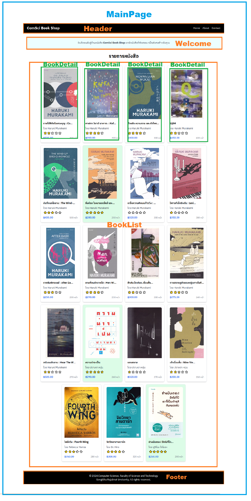

# React Component

## React Component คืออะไร?
React Component คือการแบ่งส่วนของ UI ให้เป็นส่วนย่อยๆ ที่สามารถนำมาใช้ซ้ำได้ และสามารถรับข้อมูลเข้ามาและแสดงผลออกมาได้ โดย React Component สามารถเป็น Function Component หรือ Class Component ซึ่งสามารถใช้งานได้ทั้งสองแบบ ใน Component จะรวมทั้ง HTML JavaScript และ CSS ด้วยกัน ทำให้การเขียนโค้ดของเรามีความยืดหยุ่นมากขึ้น 


## การสร้าง React Component

การสร้าง React Component สามารถทำได้โดยการสร้างไฟล์ใหม่ และเขียนโค้ดของ Component ลงไป หรือสร้าง Component ในไฟล์เดียวกันกับ Component อื่นๆ โดยการเขียนโค้ดของ Component ลงไปในฟังก์ชันหรือคลาส ตัวอย่างการสร้าง Function Component และ Class Component แสดงดังต่อไปนี้

```tsx
// Function Component
interface WelcomeProps {
  firstName: string;
  lastName: string;
  score: number;
}

function Welcome(props: WelcomeProps) {
  return <>
          <h1>Hello, {`${props.firstName} ${props.lastName}`}</h1>
          <h2>Your score is: {props.score}</h2>
  </>
}
```

การตั้งชื่อ Component Function ควรเป็นไปตามหลักการต่อไปนี้
- ชื่อของ Component ควรเป็นคำเดียว และเริ่มต้นด้วยตัวพิมพ์ใหญ่
- หากชื่อของ Component มีมากกว่าหนึ่งคำ ควรใช้ PascalCase ในการตั้งชื่อ เช่น MyHeader
- ฟังค์ชันต้องส่งคืนค่าที่สามารถแสดงผลได้ (Renderable) ได้ เช่น String, Number, Element หรือ Array และ Object ที่ประกอบด้วยค่าที่แสดงผลได้

## การใช้งาน React Component
การใช้งาน React Component สามารถทำได้โดยการเรียกใช้ Component นั้นๆ ใน Component อื่นๆ โดยการเขียนชื่อของ Component ลงไปใน JSX ตัวอย่างการใช้งาน Component แสดงดังต่อไปนี้

```tsx
function App() {
  return (
    <div>
      <Welcome firstName="จิรประภา" lastName="ริทธิ์โต" score="100"/>
      <Welcome firstName="นัควัต" lastName="จู" score="99" />
      <Welcome firstName="ภควัต" lastName="ร่มทับทิม" score="98" />
    </div>
  );
}
```

## Condition Rendering
การแสดงผลของ Component ตามเงื่อนไขสามารถทำได้โดยการใช้งานเงื่อนไขในการแสดงผล โดยใช้เงื่อนไขในการเลือกว่าจะแสดง Component นั้นหรือไม่ ตัวอย่างการใช้งานเงื่อนไขในการแสดงผล Component แสดงดังต่อไปนี้

```tsx
function App() {
  const isLoggedIn = true;
  return (
    <div>
      {isLoggedIn ? <Welcome firstName="จิรประภา" lastName="ริทธิ์โต" score="100"/> : <h1>Please log in</h1>}
    </div>
  );
}
```

แสดงข้อมูลโดยการใช้ Loop ร่วมกับ Condition Rendering สามารถทำได้โดยการใช้งาน Loop ร่วมกับ Condition Rendering ตัวอย่างการใช้งาน Loop ร่วมกับ Condition Rendering แสดงดังต่อไปนี้

```tsx
interface WelcomeProps {
  firstName: string;
  lastName: string;
  score: number;
}

function Welcome(props: WelcomeProps) {
  return (
    <>
      <h1>Hello, {`${props.firstName} ${props.lastName}`}</h1>
      <h2 className={props.score === 100 ? 'font-bold' : ''}>
        Your score is:{" "}
        {props.score === 100 ? (
          <span className="text-green-500">{props.score}</span>
        ) : (
          props.score
        )}
      </h2>
    </>
  );
}

function App() {
  const users = [
    { firstName: "จิรประภา", lastName: "ริทธิ์โต", score: 100 },
    { firstName: "นัควัต", lastName: "จู", score: 99 },
    { firstName: "ภควัต", lastName: "ร่มทับทิม", score: 98 }
  ];
  return (
    <div>
      {users.map((user) => (
        <Welcome
          key={user.firstName + user.lastName}
          firstName={user.firstName}
          lastName={user.lastName}
          score={user.score}
        />
      ))}
    </div>
  );
}
```

## LAB: การหน้าแสดงรายการหนังสือร้าน ComSci Book Shop


ภาพหนังสือประกอบจากเว็บไซต์ [se-ed.com](https://www.se-ed.com/)


### MainPage.tsx
```tsx
// TODO: Import Components ที่เกี่ยวข้องทั้งหมด

function MainPage() {

  return (
    <div className="flex flex-col min-h-screen">
    
      {/* TODO: แสดง Header  */}
      
      <main className="flex-grow container mx-auto px-4 py-6">


        {/* TODO: แสดง Welcome */}
        
        {/* TODO: แสดง BookList */}
        
        
      </main>
      
      {/* TODO: แสดง Footer */}
      
    </div>
  );
};

export default MainPage;
```

### Header.tsx
```tsx
function Header() {
  return (
    <>
        <header className="bg-black text-white py-4 shadow-md">
            <div className="container mx-auto flex justify-between items-center px-4">
                <div className="text-2xl font-bold">ComSci Book Shop</div>
                <nav>
                <ul className="flex space-x-4">
                    <li><a href="#" className="hover:text-blue-200">Home</a></li>
                    <li><a href="#" className="hover:text-blue-200">About</a></li>
                    <li><a href="#" className="hover:text-blue-200">Contact</a></li>
                </ul>
                </nav>
            </div>
        </header>
    </>
  );
};

export default Header;
```

### Footer.tsx
```tsx
function Footer() {
  return (
    <footer className="bg-black text-white py-4 mt-auto">
      <div className="container mx-auto text-center">
        <p>&copy; {new Date().getFullYear()} Computer Science,  Faculty of Science and Technology<br/>
        Songklha Rajabhat Unvisertiy. All rights reserved.</p>

      </div>
    </footer>
  );
};

export default Footer;
```

### Welcome.tsx
```tsx
function Welcome() {
  return (
    <div className="bg-cyan-50 p-6 rounded-lg shadow-md">
          <p className="text-gray-700 text-center">
            ยินดีตอนรับสู่ร้านหนังสือ <b>ComSci Book Shop</b> เรามีหนังสือที่คัดสรรมาเป็นพิเศษสำหรับคุณ
          </p>
        </div>
  )
}

export default Welcome
```

### Book.ts (Interface)
```ts
interface Book {
    id: number;
    title: string;
    author: string;
    price: number;
    pages: number;
    rating: number;
    coverUrl: string;
  }

  export default Book;
```

### BookList.tsx
```tsx
// TODO: Import Book Interface
// TODO: Import Components ที่เกี่ยวข้องทั้งหมด

function BookList() {
  const books: Book[] = []


  return (
    <div className="container mx-auto px-4 py-8">
      <h1 className="text-3xl font-bold text-center mb-8">รายการหนังสือ</h1>
      <div className="flex flex-wrap justify-center items-start">
        {/* TODO: อ่านข้อมูลใน books เพื่อแสดงรายการหนังสือผ่าน BookDetail */}
      </div>
    </div>
  );
};

export default BookList;
```

### BookDetail.tsx 
ติดตั้ง lucide-react ด้วยคำสั่ง `npm install lucide-react`
```tsx
import { Star } from 'lucide-react';

// TODO: Import Book Interface


function Rating(rating: number) {
  return Array.from({ length: 5 }, (_, index) => (
    <Star
      key={index}
      size={20}
      fill={index < rating ? '#FFD700' : '#E0E0E0'}
      className="inline-block mx-0.5"
    />
  ));
}


function BookDetail({ book }: { book: Book }) {

  const getColorByRating = (rating: number) => {
    return rating === 5
      ? 'bg-green-100'
      : 'bg-white';
  };

  // TODO: นำข้อมูลจาก book มาแสดงผลใน Component เช่น ชื่อหนังสือ ชื่อผู้แต่ง ราคา จำนวนหน้า และคะแนน

  return (
    <div  className={`border rounded-lg p-4 m-2 shadow-md hover:shadow-xl transition-shadow w-64 flex flex-col ${getColorByRating(book.rating)}`}>
      
      <h2 className="font-semibold mb-2">ชายไร้สีกับปีแสวงบุญ</h2>
      <p className="text-gray-700 mb-1">โดย Haruki Murakami</p>
      <div className="mb-2">
        {Rating(5)}
      </div>
      <div className="flex justify-between items-center mt-auto">
        <span className="text-blue-600 font-medium">฿ 320</span>
        <span className="text-gray-500 text-sm">300 หน้า</span>
      </div>
    </div>
  );
}

export default BookDetail;
```

<sup><ins>หมายเหตุ</ins> เอกสารนี้มีการใช้ Generative AI เข้ามาช่วยในการสร้างเอกสารบางส่วน และมีเพิ่มเติมข้อมูล ตลอดจนปรับปรุงข้อมูลเพื่อความเหมาะสมโดยผู้เขียน</sup> 