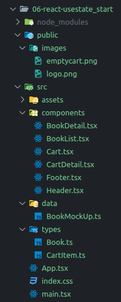
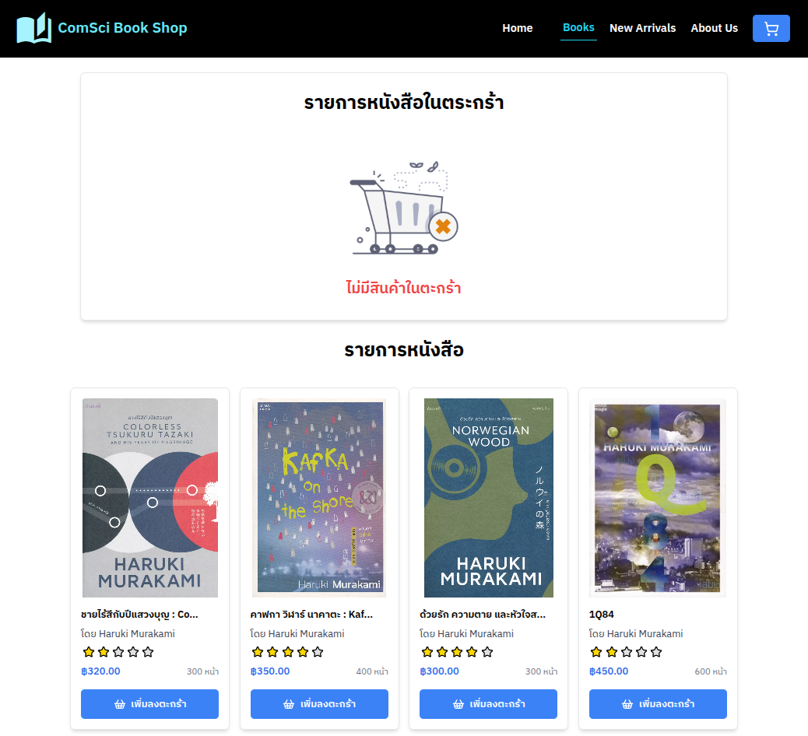

# เรียนรู้การใช้งาน Props และ useState จากโปรเจ็ค ComSci Book Shop

## เปรียบเทียบการใช้ useState กับการไม่ใช้ useState

เปรียบเทียบผลลัพธ์จากตัวอย่างต่อไปนี้

```tsx
import React, { useState } from "react";

function StateVarCompare() {
  // Regular variable
  let normalCount = 0;

  // State variable
  const [stateCount, setStateCount] = useState(0);

  const incrementNormal = () => {
    normalCount += 1;
    console.log("Normal count:", normalCount); 
  };

  const incrementState = () => {
    setStateCount(stateCount + 1);
  };

  return (
    <div>
      <p>Normal count: {normalCount}</p> 
      <button onClick={incrementNormal}>Increment Normal</button>
      <p>State count: {stateCount}</p> 
      <button onClick={incrementState}>Increment State</button>
    </div>
  );
}

export default StateVarCompare;
```

สามารถดูตัวอย่างการใช้งานเพิ่มเติมได้ที่ [CodeSandbox](https://codesandbox.io/p/sandbox/explain-some-basic-lr9ypk)

## โครงสร้างโปรเจ็ค ComSci Book Shop



### ไฟล์ Types
1. **Book.ts**
   - Interface สำหรับข้อมูลหนังสือ
   - ประกอบด้วย: id, title, author, price, pages, rating, coverUrl

2. **CartItem.ts**
   - Interface ที่สืบทอดจาก Book
   - เพิ่ม property quantity สำหรับจำนวนหนังสือในตะกร้า

### ไฟล์ Components หลัก

#### 1. App.tsx
- Component หลักของแอพพลิเคชัน
- จัดการ state:
  - `showCart`: ควบคุมการแสดง/ซ่อนตะกร้าสินค้า
  - `cartItems`: เก็บข้อมูลหนังสือในตะกร้า
- ฟังก์ชันสำคัญ:
  - `addToCart`: เพิ่มหนังสือลงตะกร้า
  - `updateQuantity`: อัพเดทจำนวนหนังสือในตะกร้า
  - `removeFromCart`: ลบหนังสือออกจากตะกร้า
  - `totalPrice`: คำนวณราคารวมของหนังสือในตะกร้า

#### 2. BookList.tsx
- แสดงรายการหนังสือทั้งหมด
- รับ props:
  - `books`: ข้อมูลหนังสือทั้งหมด
  - `addToCart`: ฟังก์ชันเพิ่มหนังสือลงตะกร้า
- ใช้ map เพื่อแสดงหนังสือแต่ละเล่มผ่าน BookDetail

#### 3. BookDetail.tsx
- แสดงรายละเอียดหนังสือแต่ละเล่ม
- รับ props:
  - `book`: ข้อมูลหนังสือ
  - `addToCart`: ฟังก์ชันเพิ่มลงตะกร้า
- มีฟังก์ชัน Rating สำหรับแสดงคะแนนด้วยดาว
- แสดงข้อมูล: รูปปก, ชื่อหนังสือ, ผู้แต่ง, ราคา, จำนวนหน้า

#### 4. Cart.tsx
- แสดงรายการหนังสือในตะกร้า
- รับ props:
  - `cartItems`: รายการหนังสือในตะกร้า
  - `updateQuantity`: ฟังก์ชันอัพเดทจำนวน
  - `removeFromCart`: ฟังก์ชันลบหนังสือ
  - `totalPrice`: ราคารวมทั้งหมด
- มีการแสดงผล 2 แบบ:
  - EmptyCart: แสดงเมื่อไม่มีสินค้าในตะกร้า
  - BooksInCart: แสดงรายการหนังสือและราคารวม

#### 5. CartDetail.tsx
- แสดงรายละเอียดหนังสือในตะกร้า
- รับ props:
  - `cartItem`: ข้อมูลหนังสือในตะกร้า
  - `updateQuantity`: ฟังก์ชันอัพเดทจำนวน
  - `removeFromCart`: ฟังก์ชันลบหนังสือ
- มีปุ่มเพิ่ม/ลดจำนวน และลบสินค้า

#### 6. Header.tsx
- แสดง header ของเว็บไซต์
- รับ props:
  - `pageName`: ชื่อหน้าปัจจุบัน
  - `setShowCart`: ฟังก์ชันแสดง/ซ่อนตะกร้า
  - `showCart`: สถานะการแสดงตะกร้า


#### 7. Footer.tsx
- แสดง footer ของเว็บไซต์
- แสดงข้อมูลลิขสิทธิ์และปีปัจจุบัน

### การจัดการข้อมูล
- ข้อมูลหนังสือถูกเก็บใน `BookMockUp.ts`
- ใช้ TypeScript interface เพื่อกำหนดโครงสร้างข้อมูล


### ฟีเจอร์หลัก
1. แสดงรายการหนังสือ
2. เพิ่มหนังสือลงตะกร้า
3. เพิ่มหรือลดจำนวนหนังสือในตะกร้า
4. ลบหนังสือออกจากตะกร้า
5. คำนวณราคารวม

### ภาพตัวอย่างการทำงาน

#### การแสดงข้อมูลหนังสือ


#### การแสดงตระกร้าสินค้า


#### การแสดงตะกร้าสินค้าว่าง



<sup><ins>หมายเหตุ</ins> เอกสารนี้มีการใช้ Generative AI เข้ามาช่วยในการสร้างเอกสารบางส่วน และมีเพิ่มเติมข้อมูล ตลอดจนปรับปรุงข้อมูลเพื่อความเหมาะสมโดยผู้เขียน</sup> 
