# React Login Form

โปรเจ็คนี้ใช้ React เวอร์ชัน 19 และ tailwindcss เวอร์ชัน 4 โดยมีการใช้ react-hook-form เพื่อจัดการฟอร์ม และ sweetalert2 เพื่อแสดงข้อความแจ้งเตือน


## 1) สร้างโปรเจ็คใหม่และติดตั้ง react-login-form

### สร้างโปรเจ็คใหม่ด้วยคำสั่ง
```
npm create vite@latest
```


### ติดตั้ง dependencies ที่จำเป็น
```
npm install react-router tailwindcss @tailwindcss/vite react-hook-form sweetalert2 lucide-react
```

### index.css แก้ไขเพื่อใช้งาน tailwindcss
```
@import "tailwindcss";
```

### vite.config.ts แก้ไขเพื่อใช้งาน tailwindcss
```
import { defineConfig } from 'vite'
import react from '@vitejs/plugin-react'
import tailwindcss from '@tailwindcss/vite'

// https://vite.dev/config/
export default defineConfig({
  plugins: [react(),tailwindcss()],
})
```

### ทำการคัดลอกไฟล์สำหรับเริ่มต้นโปรเจ็ค

คัดลอกไฟล์จาก [08_react_form_start_files.zip](files/08_react_form_start_files.zip)
## 2) สร้าง layouts/AdminLayout.tsx และ layouts/AuthLayout.tsx

### AdminLayout.tsx
```
import AdminHeader from "../components/AdminHeader";
import Footer from "../components/Footer";
import { Outlet } from "react-router";

export default function AdminLayout() {
  return (
    <>
      <AdminHeader />
      <div>
        <Outlet />
      </div>

      <Footer />
    </>
  );
}

```

### AuthLayout.tsx
```
import { Outlet } from "react-router";

export default function AuthLayout() {
  return (
    <>

      <div>
        <Outlet />
      </div>

    </>
  );
}

```

## 3) กำหนด routes เบื้องต้น ใน App.tsx

```
import {Route, Routes, BrowserRouter} from 'react-router';
import MainLayout from './layouts/MainLayout';
import BookPage from './pages/Book';
import Home from './pages/Home';
import About from './pages/About';
import New from './pages/New';
import AdminLayout from './layouts/AdminLayout';
import AdminHome from './pages/admin/AdminHome';
import AuthLayout from './layouts/AuthLayout';
import Login from './pages/auth/Login';

export default function App() {
  return (
    <BrowserRouter>
      <Routes>
        {/* Frontend Page */}
        <Route element={<MainLayout />}>
          <Route path="/" element={<Home />} />
          <Route path="/book" element={<BookPage />} />
          <Route path="/new" element={<New />} />
          <Route path="/about" element={<About />} />
        </Route>

        {/* Admin Page */}
        <Route element={<AdminLayout />}>
          <Route path="/admin" element={<AdminHome />} />
          <Route path="/admin/home" element={<AdminHome />} />
        </Route>

        {/* Auth Page */}
        <Route element={<AuthLayout />}>
          <Route path="/login" element={<Login />} />
        </Route>

        {/* Not Found */}
        <Route path="*" element={<h1 className='text-6xl text-red-500'>404 Not Found</h1>} />
      </Routes>
    </BrowserRouter>
  );
}

```


## 4) สร้าง pages/auth/login.tsx

### index.css

```
@import "tailwindcss";


@layer base {
  label {
    @apply block mb-2 text-gray-500;
  }
  
  input {
    @apply w-full p-2 mb-3 text-gray-700 border-b-2 border-gray-500 outline-none focus:bg-gray-300;
  }

}

@layer components {
  .btn-login {
    @apply w-full bg-black hover:bg-gray-700 text-white font-bold py-2 px-4 mb-6 rounded-lg;
  }
}
```

### Login.tsx 

```
import { useForm, SubmitHandler } from "react-hook-form";
import Swal from "sweetalert2";

// สร้าง interface สำหรับรับค่า email และ password
interface IFormInput {
  email: string;
  password: string;
}

function Login() {
  document.title = "Login";

  // Create useForm hook to handle form
  // สร้างตัวแปรสำหรับใช้งาน react-hook-form จาก useForm
  const {
    register,
    handleSubmit,
    formState: { errors },
  } = useForm<IFormInput>();


  // Handle form submit
  // สร้าง function สำหรับจัดการเมื่อมีการ submit form
  const onSubmit: SubmitHandler<IFormInput> = (data) => {

    if (data.email === "kesinee.bo@skru.ac.th" && data.password === "password"){
      

      let timerInterval: number;
      Swal.fire({
        title: "Login successful!",
        html: "Go to Home Page in <b></b> milliseconds.",
        timer: 2000,
        timerProgressBar: true,
        didOpen: () => {
          Swal.showLoading();
          const timer = Swal.getPopup()?.querySelector("b");
          if (timer) {
            timerInterval = setInterval(() => {
              timer.textContent = `${Swal.getTimerLeft()}`;
            }, 100);
          }
        },
        willClose: () => {
          clearInterval(timerInterval);
        },
      }).then((result) => {

        if (result.dismiss === Swal.DismissReason.timer) {
          console.log("I was closed by the timer");
          localStorage.setItem("access_token", "1234567890");
          localStorage.setItem("email", data.email);
          window.location.href = "/admin/home";
        }
      });


    }else{
      Swal.fire({
        title: "เข้าสู่ระบบไม่สำเร็จ",
        icon: "error",
      });
    }

  };

  

  return (
      <div className="flex h-screen bg-gradient-to-br from-black to-gray-500">
        <div className="w-full max-w-xs m-auto bg-gray-100 rounded p-5">
          {/* header */}
          <header className="mb-6">
            <div className="w-50 h-50 text-white p-6 bg-black rounded-full mx-auto">
              <svg
                xmlns="http://www.w3.org/2000/svg"
                fill="white"
                stroke="currentColor"
                strokeLinecap="round"
                strokeLinejoin="round"
                strokeWidth={2}
                className="w-40 h-40 text-white  mx-auto"
                viewBox="0 -960 960 960"
              >
                <path d="M560-564v-68q33-14 67.5-21t72.5-7q26 0 51 4t49 10v64q-24-9-48.5-13.5T700-600q-38 0-73 9.5T560-564Zm0 220v-68q33-14 67.5-21t72.5-7q26 0 51 4t49 10v64q-24-9-48.5-13.5T700-380q-38 0-73 9t-67 27Zm0-110v-68q33-14 67.5-21t72.5-7q26 0 51 4t49 10v64q-24-9-48.5-13.5T700-490q-38 0-73 9.5T560-454ZM260-320q47 0 91.5 10.5T440-278v-394q-41-24-87-36t-93-12q-36 0-71.5 7T120-692v396q35-12 69.5-18t70.5-6Zm260 42q44-21 88.5-31.5T700-320q36 0 70.5 6t69.5 18v-396q-33-14-68.5-21t-71.5-7q-47 0-93 12t-87 36v394Zm-40 118q-48-38-104-59t-116-21q-42 0-82.5 11T100-198q-21 11-40.5-1T40-234v-482q0-11 5.5-21T62-752q46-24 96-36t102-12q58 0 113.5 15T480-740q51-30 106.5-45T700-800q52 0 102 12t96 36q11 5 16.5 15t5.5 21v482q0 23-19.5 35t-40.5 1q-37-20-77.5-31T700-240q-60 0-116 21t-104 59ZM280-494Z" />
              </svg>
            </div>
            <div className="text-3xl font-bold w-full text-center my-5">
              ComSci Book Shop
            </div>
          </header>

          {/* form */}
          <form onSubmit={handleSubmit(onSubmit)}>
            {/* email */}
           <div>
            <label htmlFor="email">
              email
            </label>
            <input type="text" {...register("email",
              {required: true,
                minLength: 5,
                maxLength: 50,
                //pattern: /^\S+@\S+$/i
                pattern: /^[a-zA-Z0-9._%+-]+@[a-zA-Z0-9.-]+\.[a-zA-Z]{2,4}$/
              }
            )} />
            {errors.email?.type === "required" && (
              <span className="text-red-500">กรุณากรอกอีเมล์ !</span>  
            )}
            {errors.email?.type === "minLength" && (
              <span className="text-red-500">ความยาวไม่ต่ำกว่า 5 อักษร</span>  
            )}
            {errors.email?.type === "maxLength" && (
              <span className="text-red-500">ความยาวไม่เกิน 20 อักษร</span>  
            )}
            {errors.email?.type === "pattern" && (
              <span className="text-red-500">รูปแบบอีเมล์ไม่ถูกต้อง</span>  
            )}
           </div>
            {/* password */}
           <div>
            <label htmlFor="password">
              password
            </label>
            <input type="password" {...register("password",
              {required: true,
                minLength: 6,
                maxLength: 20
              })} />
              {errors.password?.type === "required" && (
              <span className="text-red-500">กรุณากรอกรหัสผ่าน !</span>  
            )}
            {errors.password?.type === "minLength" && (
              <span className="text-red-500">ความยาวไม่ต่ำกว่า 6 อักษร</span>  
            )}
            {errors.password?.type === "maxLength" && (
              <span className="text-red-500">ความยาวไม่เกิน 20 อักษร</span>  
            )}
           </div>
           <div>
              <input
                className="btn-login"
                type="submit"
                value="Login"
              />
            </div>
          </form>
        </div>
      </div>

  );
}

export default Login;

```
## 5) สร้าง routes/ProtectedRoute.tsx สำหรับป้องกันการเข้าถึงหน้า admin โดยไม่ได้ login

```
import { ReactNode } from "react"
import { Navigate } from "react-router"

type ProtectedRouteProps = {
    redirectPath?: string,
    children: ReactNode,
}

// Read token from localStorage
const token = localStorage.getItem('access_token')

const ProtectedRoute = ({ 
    redirectPath = '/login', 
    children }: ProtectedRouteProps) => {
    return token ? <>{children}</> : <Navigate to={redirectPath} />
}

export default ProtectedRoute
```

## 6) แก้ไข App.tsx ให้มีการใช้ ProtectedRoute เพื่อป้องกันการเข้าถึงหน้า admin โดยไม่ได้ login

```
{/* Admin Page */}
<Route element={<ProtectedRoute><AdminLayout /></ProtectedRoute> }>
    <Route path="/admin" element={<AdminHome />} />
    <Route path="/admin/home" element={<AdminHome />} />
</Route>
```

## 7) AdminHeader ใส่โค้ด Sign Out


```
<button
    className= "text-white hover:text-cyan-400"
    onClick={() => {
    localStorage.removeItem("access_token");
    window.location.href = "/login";
    }
}
>
    Sign Out
</button>
```


## Screenshots

### หน้า login
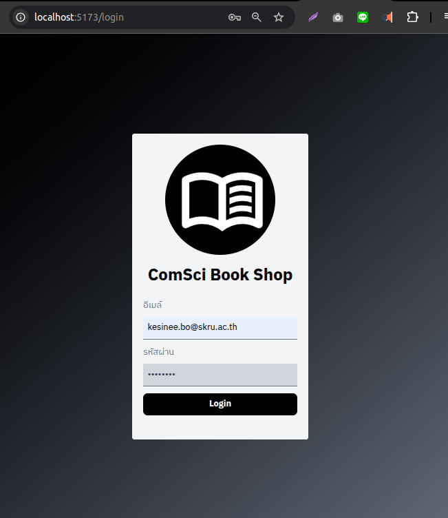


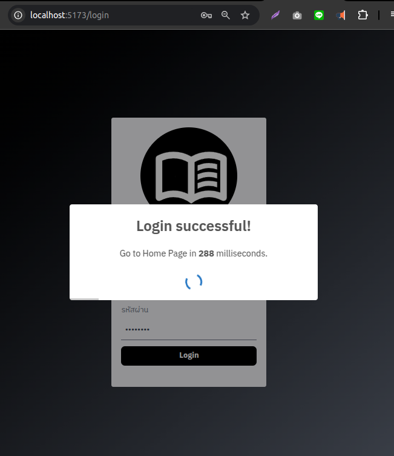


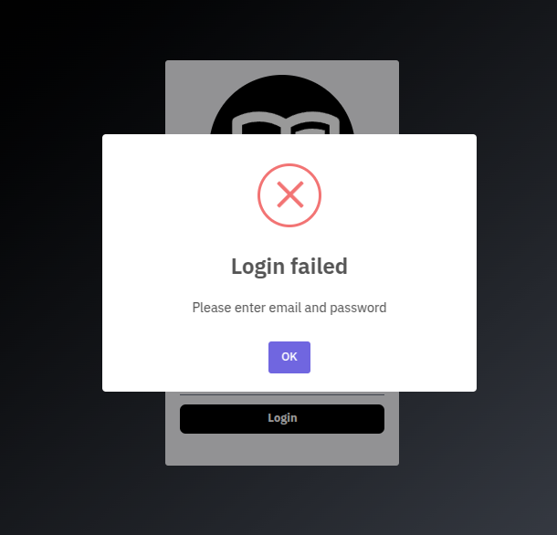

### form validation
<div style="display: grid; grid-template-columns: repeat(2, 1fr); gap: 10px;">
  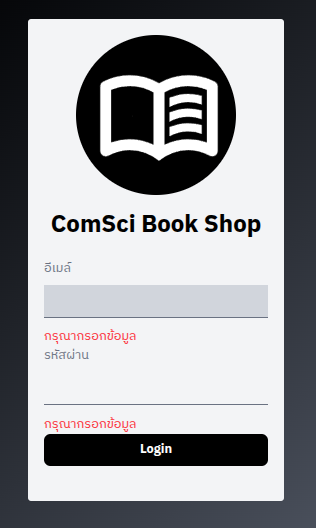
  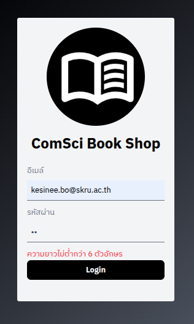
  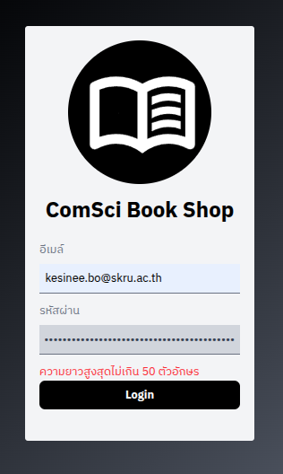
  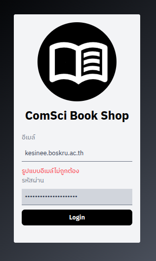
</div>


### หน้า admin และ sign out
<div style="display: grid; grid-template-columns: repeat(2, 1fr); gap: 10px;">
  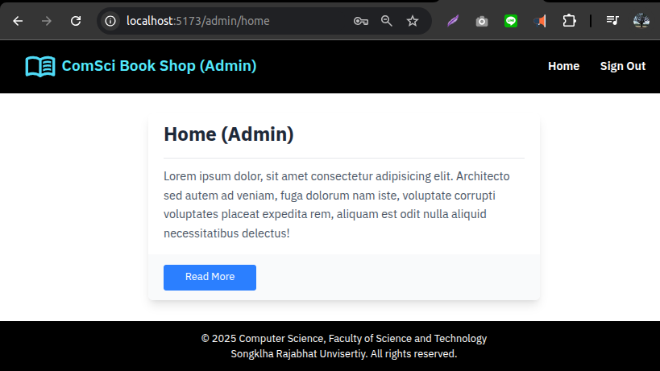
  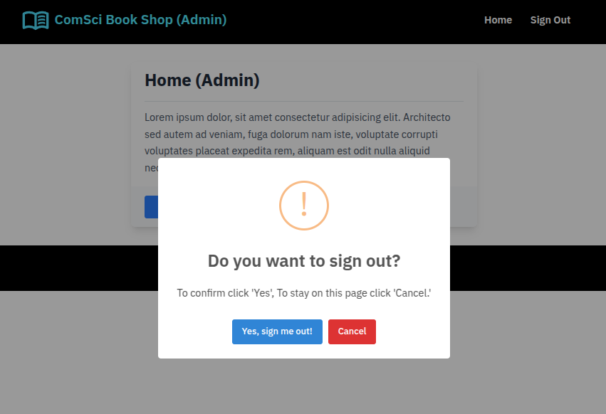
  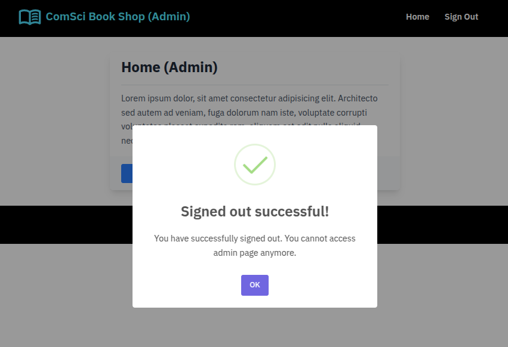
</div>


### 404 Not Found
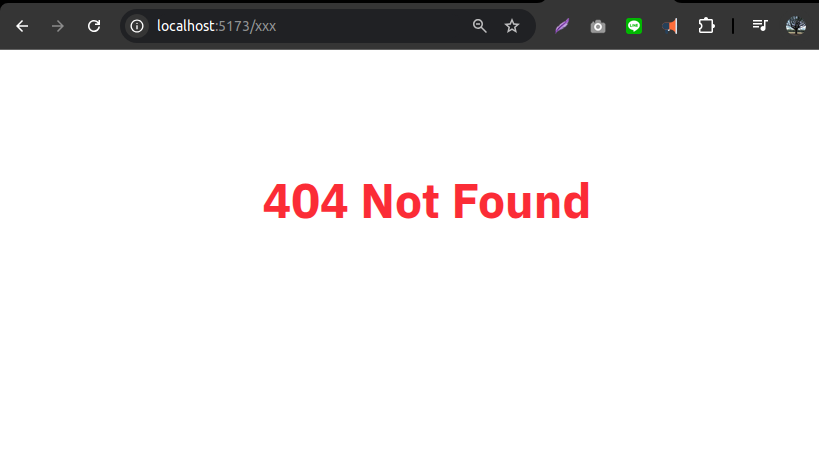


