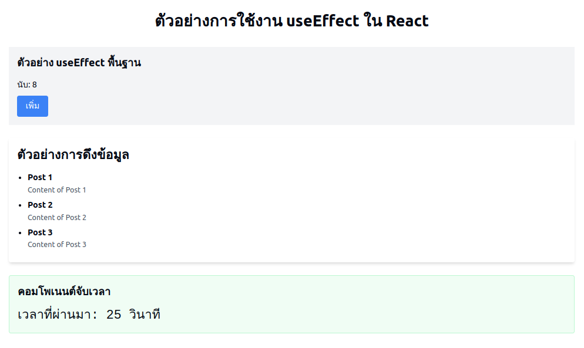

# การใช้งาน useEffect ใน React 

`useEffect` เป็น Hook ใน React ที่ใช้จัดการผลข้างเคียง (side effects) ภายใน Functional Components เช่น การดึงข้อมูลจาก API, การสมัครรับข้อมูล (subscriptions), และการจัดการ DOM โดยไม่ต้องใช้คลาสคอมโพเนนต์

## การใช้ useEffect
```tsx
useEffect(effect: EffectCallback, deps?: DependencyList)
```
- `effect`: ฟังก์ชันที่จะถูกเรียกใช้
- `deps`: อาร์เรย์ของ dependencies ที่ใช้ควบคุมว่าเมื่อใดควรเรียกใช้ effect อีกครั้ง (ถ้าเว้นไว้ useEffect จะทำงานทุกครั้งที่ component render)

## ตัวอย่างการใช้งาน useEffect



### 1. ใช้ useEffect โดยไม่มี dependencies (ทำงานทุกครั้งที่ component render)
```tsx
import { useEffect } from "react";

const ExampleComponent = () => {
  useEffect(() => {
    console.log("Component rendered");
  });

  return <div className="text-xl text-blue-600">Hello, useEffect!</div>;
};

export default ExampleComponent;
```
**คำอธิบาย**:
- `useEffect` จะทำงานทุกครั้งที่ component render


### 2. ใช้ useEffect พร้อม dependencies ว่าง (ทำงานแค่ครั้งแรกที่ component mount)
```tsx
import { useEffect } from "react";

const ExampleComponent = () => {
  useEffect(() => {
    console.log("Component mounted");
  }, []);

  return <div className="text-xl text-green-600">Mounted only once!</div>;
};

export default ExampleComponent;
```
**คำอธิบาย**:
- `useEffect` จะทำงานเพียงครั้งเดียวตอนที่ component ถูก mount เนื่องจาก `deps` เป็น `[]`


### 3. ใช้ useEffect พร้อม dependencies (ทำงานเมื่อ dependencies เปลี่ยนแปลง)
```tsx
import { useState, useEffect } from "react";

const Counter = () => {
  const [count, setCount] = useState(0);

  useEffect(() => {
    console.log(`Count updated: ${count}`);
  }, [count]);

  return (
    <div className="flex flex-col items-center space-y-4 p-4">
      <p className="text-2xl font-bold text-gray-800">Count: {count}</p>
      <button
        className="px-4 py-2 bg-blue-500 text-white rounded-lg hover:bg-blue-700"
        onClick={() => setCount(count + 1)}
      >
        Increment
      </button>
    </div>
  );
};

export default Counter;
```
**คำอธิบาย**:
- `useEffect` จะทำงานทุกครั้งที่ค่า `count` เปลี่ยนแปลง


### 4. Cleanup Effect (ล้างข้อมูลเมื่อ Component Unmount)
```tsx
import { useState, useEffect } from "react";

const Timer = () => {
  const [seconds, setSeconds] = useState(0);

  useEffect(() => {
    const interval = setInterval(() => {
      setSeconds((prev) => prev + 1);
    }, 1000);

    return () => {
      clearInterval(interval);
      console.log("Timer stopped");
    };
  }, []);

  return <div className="text-2xl text-red-500">Seconds: {seconds}</div>;
};

export default Timer;
```
**คำอธิบาย**:
- `useEffect` ตั้งค่า `setInterval` เพื่ออัปเดตค่าทุกวินาที
- ฟังก์ชัน `return` ทำหน้าที่ cleanup เมื่อตัว component ถูก unmount


## สรุป
- `useEffect(() => {...})` ทำงานทุกครั้งที่มีการ render
- `useEffect(() => {...}, [])` ทำงานแค่ครั้งแรกที่ component mount
- `useEffect(() => {...}, [dependency])` ทำงานเมื่อ dependencies เปลี่ยนค่า
- `useEffect` สามารถ return ฟังก์ชันเพื่อทำ cleanup เมื่อ component ถูก unmount

## ตัวอย่างโค้ดการใช้งาน useEffect ใน React
```tsx
import React, { useState, useEffect } from 'react';

// ตัวอย่างพื้นฐาน: บันทึกวงจรชีวิตของคอมโพเนนต์
const BasicEffectComponent: React.FC = () => {
  const [count, setCount] = useState(0);

  // useEffect พื้นฐานที่ทำงานทุกครั้งหลังจาก render
  useEffect(() => {
    console.log('คอมโพเนนต์ถูก render หรืออัปเดต');

    // ฟังก์ชันทำความสะอาด (ถ้าต้องการ)
    return () => {
      console.log('คอมโพเนนต์กำลังจะถอดออกหรือ re-render');
    };
  });

  return (
    <div className="p-4 bg-gray-100">
      <h2 className="text-xl font-bold mb-4">ตัวอย่าง useEffect พื้นฐาน</h2>
      <p>นับ: {count}</p>
      <button 
        onClick={() => setCount(count + 1)}
        className="mt-2 px-4 py-2 bg-blue-500 text-white rounded"
      >
        เพิ่ม
      </button>
    </div>
  );
};

// ตัวอย่าง: Effect แบบมีเงื่อนไขด้วย Dependency Array
const DataFetchComponent: React.FC = () => {
  const [data, setData] = useState<string[]>([]);
  const [loading, setLoading] = useState(true);

  useEffect(() => {
    const fetchData = async () => {
      try {
        // จำลองการเรียก API
        const response = await fetch('https://jsonplaceholder.org/posts');
        const result = await response.json();
        setData(result);
      } catch (error) {
        console.error('เกิดข้อผิดพลาดในการดึงข้อมูล:', error);
      } finally {
        setLoading(false);
      }
    };

    fetchData();
  }, []); // Array ว่างหมายถึงให้ effect ทำงานเพียงครั้งเดียวตอนเริ่มต้น

   return (
    <div className="p-4 bg-white shadow-md rounded">
      <h2 className="text-2xl font-semibold mb-4">ตัวอย่างการดึงข้อมูล</h2>
      {loading ? (
        <p className="text-gray-500">กำลังโหลด...</p>
      ) : (
        <ul className="list-disc pl-5">
          {data.map((item) => (
            <li key={item.id} className="mb-2">
              <strong>{item.title}</strong>
              <p className="text-sm text-gray-600">{item.body}</p>
            </li>
          ))}
        </ul>
      )}
    </div>
  );
};

// ตัวอย่างขั้นสูง: Effect พร้อมฟังก์ชันทำความสะอาด
const TimerComponent: React.FC = () => {
  const [seconds, setSeconds] = useState(0);

  useEffect(() => {
    // สร้าง interval ที่อัปเดตทุกวินาที
    const intervalId = setInterval(() => {
      setSeconds(prev => prev + 1);
    }, 1000);

    // ฟังก์ชันทำความสะอาดเพื่อหยุด interval เมื่อคอมโพเนนต์ถอดออก
    return () => {
      clearInterval(intervalId);
    };
  }, []); // Array ว่างป้องกันการสร้าง interval ใหม่

  return (
    <div className="p-4 bg-green-50 border-2 border-green-200 rounded">
      <h2 className="text-xl font-bold mb-4">คอมโพเนนต์จับเวลา</h2>
      <p className="text-2xl font-mono">
        เวลาที่ผ่านมา: {seconds} วินาที
      </p>
    </div>
  );
};

// คอมโพเนนต์คู่มือ useEffect แบบครอบคลุม
const UseEffectGuide: React.FC = () => {
  return (
    <div className="container mx-auto p-6 space-y-6">
      <h1 className="text-3xl font-bold text-center mb-8">
        ตัวอย่างการใช้งาน useEffect ใน React
      </h1>

      <div className="grid md:grid-cols-3 gap-6">
        <BasicEffectComponent />
        <DataFetchComponent />
        <TimerComponent />
      </div>
    </div>
  );
};

export default UseEffectGuide;
```


<sup><ins>หมายเหตุ</ins> เอกสารนี้มีการใช้ Generative AI เข้ามาช่วยในการสร้างเอกสารบางส่วน และมีเพิ่มเติมข้อมูล ตลอดจนปรับปรุงข้อมูลเพื่อความเหมาะสมโดยผู้เขียน</sup>