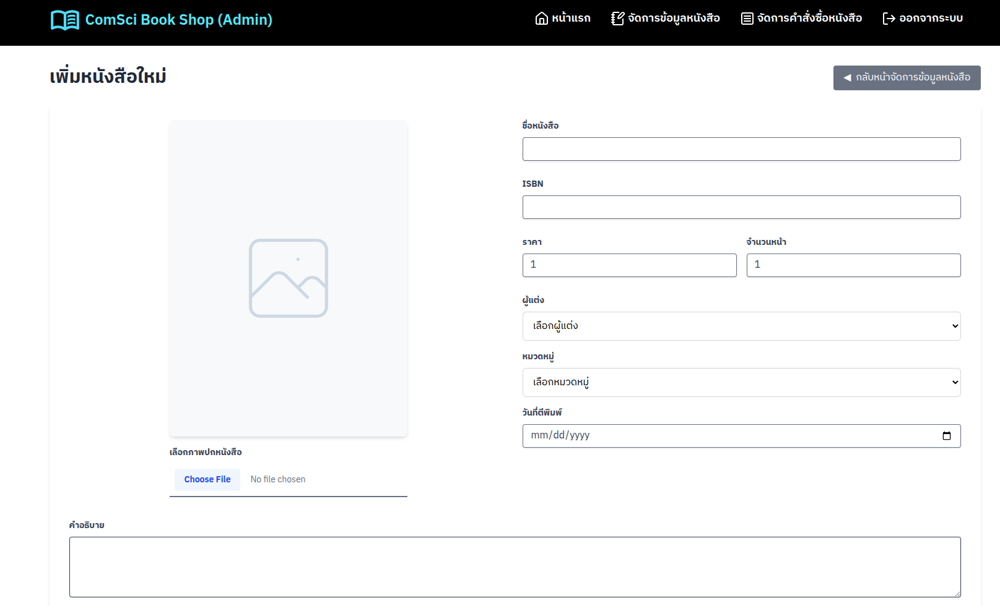

# ตัวอย่าง ComSci Book Shop (CRUD) : Part 2 หน้าการเพิ่มหนังสือใหม่



## 1) การใช้ Navigation และการจัดการ State

### วัตถุประสงค์
- เข้าใจการใช้งาน React Router
- เข้าใจการใช้งาน useForm Hook
- เข้าใจการสร้างและจัดการ State สำหรับการอัปโหลดไฟล์

### เนื้อหา
1. การใช้งาน useNavigate สำหรับการนำทาง
2. การตั้งค่า useForm สำหรับจัดการฟอร์ม
3. การกำหนด State สำหรับจัดการไฟล์และสถานะการบันทึก

### กิจกรรม
- ให้ผู้เรียนเติมโค้ดส่วนการนำเข้า hooks และการสร้าง state ตามที่ระบุด้วย TODO 1-3

```typescript
// 📌 1) เรียกใช้ hooks ที่จำเป็น และ service ต่างๆ
const navigate = useNavigate();
const { addBook, uploadBookCover, updateThumbnailUrl } = useBooks();

// 📌 2) สร้าง state สำหรับจัดการไฟล์ภาพปกหนังสือ
const [coverFile, setCoverFile] = useState<File | null>(null);
const [coverPreview, setCoverPreview] = useState<string>("");
const [coverFileError, setCoverFileError] = useState<string | null>(null);

// 📌 3) สร้าง state สำหรับจัดการสถานะการบันทึกข้อมูล
const [isSaving, setIsSaving] = useState<boolean>(false);
const [saveError, setSaveError] = useState<string | null>(null);
```

## 2) การใช้งาน React Hook Form

### วัตถุประสงค์
- เข้าใจการใช้งาน React Hook Form สำหรับการจัดการฟอร์ม
- เข้าใจการกำหนดค่าเริ่มต้นและการตรวจสอบข้อมูล

### เนื้อหา
1. การติดตั้ง hook useForm
2. การกำหนดค่าเริ่มต้นของฟอร์ม
3. การรับค่า errors และฟังก์ชันอื่นๆ จาก useForm

### กิจกรรม
- ให้ผู้เรียนเติมโค้ดส่วนการตั้งค่า useForm ตามที่ระบุด้วย TODO 4

```typescript
// 📌 4) สร้าง useForm สำหรับจัดการฟอร์ม
const {
  register,
  handleSubmit,
  setValue,
  formState: { errors },
} = useForm<BookFormData>({
  defaultValues: {
    title: "",
    shortDescription: "",
    isbn: "",
    authorid: 0,
    category: "",
    price: 1,
    pageCount: 1,
    thumbnailUrl: "",
    publishedDate: "",
  },
});
```

## 3) การจัดการอัปโหลดไฟล์

### วัตถุประสงค์
- เข้าใจการจัดการการอัปโหลดไฟล์รูปภาพ
- เข้าใจการสร้าง Preview ของรูปภาพ

### เนื้อหา
1. การรับไฟล์จาก input
2. การตรวจสอบไฟล์
3. การสร้าง Preview ของรูปภาพ

### กิจกรรม
- ให้ผู้เรียนเติมโค้ดส่วนการจัดการไฟล์ตามที่ระบุด้วย TODO 5

```typescript
// 📌 5) สร้างฟังก์ชันสำหรับจัดการการเปลี่ยนแปลงของไฟล์รูปภาพ
const handleFileChange = (e: ChangeEvent<HTMLInputElement>) => {
  if (e.target.files && e.target.files[0]) {
    const file = e.target.files[0];
    setCoverFile(file);
    setCoverFileError(null);

    // Create a preview
    const reader = new FileReader();
    reader.onload = () => {
      setCoverPreview(reader.result as string);
    };
    reader.readAsDataURL(file);
  }
};
```


## 4) การจัดการการส่งฟอร์ม

### วัตถุประสงค์
- เข้าใจการใช้งาน API ในการส่งข้อมูล
- เข้าใจการเรียกใช้งานหลาย API แบบต่อเนื่อง
- เข้าใจการจัดการข้อผิดพลาดและการแสดงผล

### เนื้อหา
1. การตรวจสอบข้อมูลก่อนส่ง
2. การเรียกใช้งาน API เพื่อเพิ่มหนังสือ
3. การเรียกใช้งาน API เพื่ออัปโหลดปกหนังสือ
4. การอัปเดต URL ของปกหนังสือ
5. การแสดงผลเมื่อสำเร็จและการนำทางไปยังหน้าอื่น

### กิจกรรม
- ให้ผู้เรียนเติมโค้ดส่วนการส่งฟอร์มตามที่ระบุด้วย TODO 6

```typescript
// 📌 6) สร้างฟังก์ชันสำหรับการส่งฟอร์ม
const onSubmit: SubmitHandler<BookFormData> = async (data) => {
  // ตรวจสอบว่ามีการเลือกไฟล์ภาพปกหนังสือหรือไม่
  if (!coverFile) {
    setCoverFileError("กรุณาเลือกภาพปกหนังสือ");
    return; // หยุดการส่งฟอร์มหากไม่มีไฟล์ถูกเลือก
  }

  // เริ่มกระบวนการบันทึกข้อมูล
  setIsSaving(true);
  setSaveError(null);

  try {
    // เพิ่มหนังสือใหม่
    const newBook = await addBook(data as Omit<Book, "bookid">);

    if (newBook && coverFile) {
      // อัปโหลดปกหนังสือถ้ามีการเลือกไฟล์
      await uploadBookCover(newBook.bookid, coverFile);
    }

    // สร้างข้อมูลใหม่ที่มีการอัปเดต thumbnailUrl
    const updatedData = {
      ...data,
      thumbnailUrl: `${import.meta.env.VITE_BASE_URL_API}/books/cover/${newBook.bookid}`
    };
    
    // ตั้งค่า thumbnailUrl ในฟอร์ม (สำหรับอ้างอิงในอนาคต)
    setValue("thumbnailUrl", updatedData.thumbnailUrl);
    
    // เรียกใช้ API เพื่ออัปเดต thumbnailUrl
    const result = await updateThumbnailUrl(newBook.bookid, updatedData);

    // ตรวจสอบผลลัพธ์และแสดงข้อความแจ้งเตือน
    if (result.error === false) {
      Swal.fire({
        title: "เพิ่มหนังสือสำเร็จ",
        text: "คุณได้เพิ่มหนังสือเรียบร้อยแล้ว กำลังพาคุณไปหน้าจัดการข้อมูลหนังสือ",
        icon: "success"
      }).then(() => {
        // นำทางกลับไปหน้าจัดการข้อมูลหนังสือ
        window.location.href = "/admin/book";
      });
    }
  } catch (err) {
    // จัดการข้อผิดพลาด
    setSaveError("ไม่สามารถบันทึกข้อมูลหนังสือได้ กรุณาลองอีกครั้ง");
    console.error(err);
  } finally {
    // รีเซ็ตสถานะการบันทึก
    setIsSaving(false);
  }
};
```

## 5) การรีเซ็ตฟอร์ม (เครียร์ค่าเพื่อกลับไปเริ่มต้นการเพิ่มข้อมูล)

### วัตถุประสงค์
- เข้าใจการรีเซ็ตข้อมูลในฟอร์ม
- เข้าใจการรีเซ็ตสถานะทั้งหมด

### เนื้อหา
1. การรีเซ็ตค่าในฟอร์ม
2. การรีเซ็ตสถานะที่เกี่ยวข้องกับการอัปโหลดไฟล์

### กิจกรรม
- ให้ผู้เรียนเติมโค้ดส่วนการรีเซ็ตฟอร์มตามที่ระบุด้วย TODO 7

```typescript
// 📌 7) สร้างฟังก์ชันสำหรับรีเซ็ตฟอร์ม
const resetForm = () => {
  setValue("title", "");
  setValue("shortDescription", "");
  setValue("isbn", "");
  setValue("authorid", 0);
  setValue("category", "");
  setValue("price", 1);
  setValue("pageCount", 1);
  setValue("thumbnailUrl", "");
  setValue("publishedDate", "");
  setCoverFile(null);
  setCoverPreview("");
  setCoverFileError(null);
};
```

## Code เริ่มต้น (pages/admin/AddBook.tsx)
```typescript
import { useState, ChangeEvent } from "react";
import { useNavigate } from "react-router";
import { useForm, SubmitHandler } from "react-hook-form";
import { useBooks } from "../../services/BookService";
import { authors } from "../../data/AuthorData";
import { categories } from "../../data/CategoryData";
import Book from "../../types/Book";
import Swal from "sweetalert2";

type BookFormData = {
  title: string;
  shortDescription: string;
  isbn: string;
  authorid: number;
  category: string;
  price: number;
  pageCount: number;
  thumbnailUrl: string;
  publishedDate: string;
};

function AddBook() {
  // 📌 1) เรียกใช้ hooks ที่จำเป็น และ service ต่างๆ
  

  // 📌 2) สร้าง state สำหรับจัดการไฟล์ภาพปกหนังสือ
  

  // 📌 3) สร้าง state สำหรับจัดการสถานะการบันทึกข้อมูล
  

  // 📌 4) สร้าง useForm สำหรับจัดการฟอร์ม
  

  // 📌 5) สร้างฟังก์ชันสำหรับจัดการการเปลี่ยนแปลงของไฟล์รูปภาพ
  

  // 📌 6) สร้างฟังก์ชันสำหรับการส่งฟอร์ม
  

  // 📌 7) สร้างฟังก์ชันสำหรับรีเซ็ตฟอร์ม
  

  return (
    <div className="container mx-auto px-4 py-8">
      <div className="flex justify-between items-center mb-6">
        <h1 className="text-3xl font-bold text-gray-800">เพิ่มหนังสือใหม่</h1>
        <button
          onClick={() => navigate(-1)}
          className="px-4 py-2 bg-gray-500 hover:bg-gray-600 text-white rounded transition"
        >
          <span className="inline-block mr-1">&#9664;</span>{" "}
          กลับหน้าจัดการข้อมูลหนังสือ
        </button>
      </div>

      {saveError && (
        <div
          className="bg-red-100 border border-red-400 text-red-700 px-4 py-3 rounded relative mb-4"
          role="alert"
        >
          <strong className="font-bold">Error!</strong>
          <span className="block sm:inline"> {saveError}</span>
        </div>
      )}

      <form
        onSubmit={handleSubmit(onSubmit)}
        className="bg-white shadow-md rounded px-8 pt-6 pb-8 mb-4"
      >
        <div className="grid grid-cols-1 md:grid-cols-2 gap-6">
          {/* Book Cover */}
          <div className="col-span-1 flex flex-col items-center">
            <div className="w-full h-full max-w-sm mb-4">
              
            </div>
            <label className="w-full max-w-sm">
              <span className="block text-gray-700 text-sm font-bold mb-2">
                เลือกภาพปกหนังสือ
              </span>
              <input
                type="file"
                accept="image/*"
                onChange={handleFileChange}
                className="block w-full text-sm text-gray-500
                  file:mr-4 file:py-2 file:px-4
                  file:rounded file:border-0
                  file:text-sm file:font-semibold
                  file:bg-blue-50 file:text-blue-700
                  hover:file:bg-blue-100"
              />
              {coverFileError && (
                <p className="text-red-500 text-xs italic mt-1">
                  {coverFileError}
                </p>
              )}
            </label>
          </div>

          {/* Book Details */}
          <div className="col-span-1">
            <div className="mb-4">
              <label
                className="block text-gray-700 text-sm font-bold mb-2"
                htmlFor="title"
              >
                ชื่อหนังสือ
              </label>
              <input
                className={`shadow appearance-none border rounded w-full py-2 px-3 text-gray-700 leading-tight focus:outline-none focus:shadow-outline ${
                  errors.title ? "border-red-500" : ""
                }`}
                id="title"
                type="text"
                {...register("title", { required: "กรุณาระบุชื่อหนังสือ" })}
              />
              {errors.title && (
                <p className="text-red-500 text-xs italic">
                  {errors.title.message}
                </p>
              )}
            </div>

            <div className="mb-4">
              <label
                className="block text-gray-700 text-sm font-bold mb-2"
                htmlFor="isbn"
              >
                ISBN
              </label>
              <input
                className={`shadow appearance-none border rounded w-full py-2 px-3 text-gray-700 leading-tight focus:outline-none focus:shadow-outline ${
                  errors.isbn ? "border-red-500" : ""
                }`}
                id="isbn"
                type="text"
                {...register("isbn", {
                  required: "กรุณาระบุ ISBN",
                  maxLength: {
                    value: 10,
                    message: "ISBN ความยาวไม่เกิน 10 ตัวอักษร",
                  },
                })}
              />
              {errors.isbn && (
                <p className="text-red-500 text-xs italic">
                  {errors.isbn.message}
                </p>
              )}
            </div>

            {/* ส่วนแสดงรายละเอียดหนังสือต่างๆ */}
            <div className="grid grid-cols-2 gap-4">
              <div className="mb-4">
                <label
                  className="block text-gray-700 text-sm font-bold mb-2"
                  htmlFor="price"
                >
                  ราคา
                </label>
                <input
                  className={`shadow appearance-none border rounded w-full py-2 px-3 text-gray-700 leading-tight focus:outline-none focus:shadow-outline ${
                    errors.price ? "border-red-500" : ""
                  }`}
                  id="price"
                  type="number"
                  min="1"
                  //step="0.01"
                  {...register("price", {
                    required: "กรุณาระบุราคา",
                    min: { value: 0, message: "ราคาต่ำสุดต้องมากกว่า 0 บาท" },
                    valueAsNumber: true,
                  })}
                />
                {errors.price && (
                  <p className="text-red-500 text-xs italic">
                    {errors.price.message}
                  </p>
                )}
              </div>

              <div className="mb-4">
                <label
                  className="block text-gray-700 text-sm font-bold mb-2"
                  htmlFor="pageCount"
                >
                  จำนวนหน้า
                </label>
                <input
                  className={`shadow appearance-none border rounded w-full py-2 px-3 text-gray-700 leading-tight focus:outline-none focus:shadow-outline ${
                    errors.pageCount ? "border-red-500" : ""
                  }`}
                  id="pageCount"
                  type="number"
                  min="1"
                  {...register("pageCount", {
                    required: "กรุณาระบุจำนวนหน้า",
                    min: {
                      value: 1,
                      message: "จำนวนหน้าต้องมีอย่างน้อย 1 หน้า",
                    },
                    valueAsNumber: true,
                  })}
                />
                {errors.pageCount && (
                  <p className="text-red-500 text-xs italic">
                    {errors.pageCount.message}
                  </p>
                )}
              </div>
            </div>
            
            <div className="mb-4">
              <label
                className="block text-gray-700 text-sm font-bold mb-2"
                htmlFor="authorid"
              >
                ผู้แต่ง
              </label>
              <select
                id="authorid"
                className={`w-full px-3 py-2 border border-gray-300 rounded-md focus:outline-none focus:ring-2 focus:ring-blue-500 ${
                  errors.authorid ? "border-red-500" : ""
                }`}
                {...register("authorid", {
                  required: "กรุณาเลือกผู้แต่ง",
                  min: { value: 1, message: "กรุณาเลือกผู้แต่ง" },
                  valueAsNumber: true,
                })}
              >
                <option value="0">เลือกผู้แต่ง</option>
                {authors.map((author) => (
                  <option key={author.id} value={Number(author.id)}>
                    {author.name}
                  </option>
                ))}
              </select>
              {errors.authorid && (
                <p className="text-red-500 text-xs italic">
                  {errors.authorid.message}
                </p>
              )}
            </div>
            
            <div className="mb-4">
              <label
                className="block text-gray-700 text-sm font-bold mb-2"
                htmlFor="category"
              >
                หมวดหมู่
              </label>
              <select
                id="category"
                className={`w-full px-3 py-2 border border-gray-300 rounded-md focus:outline-none focus:ring-2 focus:ring-blue-500 ${
                  errors.category ? "border-red-500" : ""
                }`}
                {...register("category", { required: "กรุณาเลือกหมวดหมู่" })}
              >
                <option value="">เลือกหมวดหมู่</option>
                {categories.map((category) => (
                  <option key={category} value={category}>
                    {category}
                  </option>
                ))}
              </select>
              {errors.category && (
                <p className="text-red-500 text-xs italic">
                  {errors.category.message}
                </p>
              )}
            </div>
            
            <div className="mb-4">
              <label
                className="block text-gray-700 text-sm font-bold mb-2"
                htmlFor="publishedDate"
              >
                วันที่ตีพิมพ์
              </label>
              <input
                className={`shadow appearance-none border rounded w-full py-2 px-3 text-gray-700 leading-tight focus:outline-none focus:shadow-outline ${
                  errors.publishedDate ? "border-red-500" : ""
                }`}
                id="publishedDate"
                type="date"
                {...register("publishedDate", { required: "กรุณาระบุวันที่" })}
              />
              {errors.publishedDate && (
                <p className="text-red-500 text-xs italic">
                  {errors.publishedDate.message}
                </p>
              )}
            </div>

          </div>
        </div>

        {/* Description - Full Width */}
        <div className="mb-4 mt-4">
          <label
            className="block text-gray-700 text-sm font-bold mb-2"
            htmlFor="shortDescription"
          >
            คำอธิบาย
          </label>
          <textarea
            className={`shadow appearance-none border rounded w-full py-2 px-3 text-gray-700 leading-tight focus:outline-none focus:shadow-outline ${
              errors.shortDescription ? "border-red-500" : ""
            }`}
            id="shortDescription"
            rows={4}
            {...register("shortDescription", { required: "กรุณาระบุคำอธิบาย" })}
          />
          {errors.shortDescription && (
            <p className="text-red-500 text-xs italic">
              {errors.shortDescription.message}
            </p>
          )}
        </div>

        <div className="flex items-center justify-end gap-4 mt-6">
          <button
            type="button"
            onClick={() => resetForm()}
            className="px-4 py-2 bg-gray-200 text-gray-700 rounded hover:bg-gray-300 transition"
          >
            ยกเลิก
          </button>
          <button
            type="submit"
            disabled={isSaving}
            className={`px-4 py-2 bg-blue-500 text-white rounded hover:bg-blue-600 transition ${
              isSaving ? "opacity-50 cursor-not-allowed" : ""
            }`}
          >
            {isSaving ? "กำลังบันทึก..." : "เพิ่มหนังสือ"}
          </button>
        </div>
      </form>
    </div>
  );
}

export default AddBook;

```


<sup><ins>หมายเหตุ</ins> เอกสารนี้มีการใช้ Generative AI เข้ามาช่วยในการสร้างเอกสารบางส่วน และมีเพิ่มเติมข้อมูล ตลอดจนปรับปรุงข้อมูลเพื่อความเหมาะสมโดยผู้เขียน</sup>