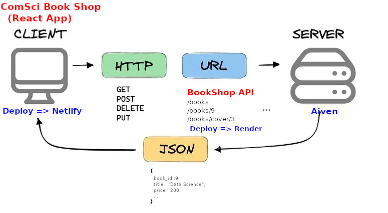

# ตัวอย่างการ Deploy โปรเจ็ค React

## Ex-1 : ตัวอย่างการ Deploy โปรเจ็ค BookShop 
* ฐานข้อมูลจาก [Aiven](https://aiven.io/) 
* Deploy API ไปยัง [Render](https://render.com/)
* Deploy React ผ่าน [Netlify](https://www.netlify.com/)



### 1) สมัครสมาชิกบริการทั้งหมดที่ต้องใช้งาน 

### 2) สร้างฐานข้อมูลใน Aiven 


นำค่าที่ได้จาก aiven ในส่วน Connection information สร้าง connection ผ่าน MySQL Workbench


รัน Database Script จากไฟล์ที่ให้มานี้ [Scripts](files/17_BookShopDBScript_Aiven.sql)

### 3) ปรับปรุงโค้ดในส่วนการติดต่อฐานข้อมูลของโปรเจ็ค API 
ติดตั้ง mysql2
```
npm install mysql2
```
แก้ไข config/db.js ดังนี้ โดยการเปลี่ยนไปใช้ mysql2 และเพิ่มการระบุ port

```
'use strict';
const mysql = require('mysql2');
const dbConn = mysql.createConnection({
  host     : process.env.MYSQL_HOST,
  port     : process.env.MYSQL_PORT,
  user     : process.env.MYSQL_USER,
  password : process.env.MYSQL_PASSWORD,
  database : process.env.MYSQL_DATABASE
});
dbConn.connect(function(err) {
  if (err) throw err;
  console.log("Database Connected!");
});
module.exports = dbConn;
```

นำค่าที่ได้จาก aiven ในส่วน Connection information ไปปรับปรุง .env โดยส่วน xxx ให้ใช้จาก aiven นำมาปรับปรุง


```
MYSQL_USER="xxx"
MYSQL_PASSWORD="xxx"
MYSQL_DATABASE="bookshopdb"
MYSQL_HOST="xxx"
MYSQL_PORT=xxx
```

เมื่อเสร็จแล้วให้ทดลองรันโปรเจ็ค API และทดสอบผ่าน testing/books.http

### 4) Deploy โปรเจ็ค API ผ่านบริการของ Render

นำโค้ดของโปรเจ็คเก็บไว้ใน Github Repository และทำการ Deploy ผ่าน Github
เมื่อเสร็จแล้วทดสอบโดยการเรียก

https://xxxx.onrender.com/api/v2/books

โดย https://xxxx.onrender.com/ คือ url ที่ได้หลังจาก Deploy สำเร็จ

### 5) Update ThumbnailUrl

ทำการปรับปรุงลิงค์ไปยังภาพ (ThumbnailUrl) จาก Url ของ Render ที่ได้เมื่อทำการ Deploy เสร็จ 
```
UPDATE books
SET ThumbnailUrl = REPLACE(ThumbnailUrl, 'http://localhost:3000', 'https://xxxxxx.onrender.com')
WHERE ThumbnailUrl LIKE '%http://localhost:3000%';
```

ทดสอบเรียกดูภาพจาก

https://xxxxxx.onrender.com/api/v2/books/cover/1


### 6) Deploy โปรเจ็ค React
ทำการ Deploy ไปยัง Netlify โดยการ Build หรือผ่าน Github ก็ได้
```
npm run build
```
กำหนด .env หรือผ่านทาง Environment Variable ของ Netlify ให้ตรงกับ Url ของ Render

VITE_BASE_URL_API=https://xxxxxx.onrender.com/api/v2

## Ex-2 : ตัวอย่าง Memo App ซึ่งติดต่อกับฐานข้อมูล Supabase


### 1) สมัครสมาชิก [Supabase](https://supabase.com/)

### 2) ใช้ Database Script ที่ให้มาเพื่อสร้างฐานข้อมูลใน Supabase

```
-- Create tables
CREATE TABLE IF NOT EXISTS public.profiles (
  id UUID PRIMARY KEY DEFAULT uuid_generate_v4(),
  updated_at TIMESTAMP WITH TIME ZONE DEFAULT now(),
  username TEXT UNIQUE NOT NULL,
  email TEXT UNIQUE NOT NULL,
  avatar_url TEXT
);

ALTER TABLE public.profiles ALTER COLUMN id SET DEFAULT auth.uid();

CREATE TABLE IF NOT EXISTS public.categories (
  id UUID PRIMARY KEY DEFAULT uuid_generate_v4(),
  created_at TIMESTAMP WITH TIME ZONE DEFAULT now(),
  name TEXT NOT NULL,
  user_id UUID NOT NULL REFERENCES public.profiles(id) ON DELETE CASCADE
);

CREATE TABLE IF NOT EXISTS public.memos (
  id UUID PRIMARY KEY DEFAULT uuid_generate_v4(),
  created_at TIMESTAMP WITH TIME ZONE DEFAULT now(),
  updated_at TIMESTAMP WITH TIME ZONE DEFAULT now(),
  title TEXT NOT NULL,
  content TEXT NOT NULL,
  category_id UUID NOT NULL REFERENCES public.categories(id) ON DELETE CASCADE,
  user_id UUID NOT NULL REFERENCES public.profiles(id) ON DELETE CASCADE,
  image_url TEXT
);

-- Create functions to handle updated_at for memos
CREATE OR REPLACE FUNCTION handle_updated_at()
RETURNS TRIGGER AS $$
BEGIN
  NEW.updated_at = now();
  RETURN NEW;
END;
$$ LANGUAGE plpgsql;

-- Create trigger for handling updated_at
CREATE TRIGGER on_memos_update
  BEFORE UPDATE ON public.memos
  FOR EACH ROW EXECUTE PROCEDURE handle_updated_at();

-- Insert sample data with RLS temporarily disabled
-- Disable RLS
ALTER TABLE public.profiles DISABLE ROW LEVEL SECURITY;
ALTER TABLE public.categories DISABLE ROW LEVEL SECURITY;
ALTER TABLE public.memos DISABLE ROW LEVEL SECURITY;


-- Re-enable RLS
ALTER TABLE public.profiles ENABLE ROW LEVEL SECURITY;
ALTER TABLE public.categories ENABLE ROW LEVEL SECURITY;
ALTER TABLE public.memos ENABLE ROW LEVEL SECURITY;

-- Now set up RLS policies
-- Profiles policies
CREATE POLICY "Public profiles are viewable by everyone"
  ON public.profiles FOR SELECT
  USING (true);

CREATE POLICY "Users can insert their own profile"
  ON public.profiles FOR INSERT
  WITH CHECK (auth.uid() = id);

CREATE POLICY "Users can update their own profile"
  ON public.profiles FOR UPDATE
  USING (auth.uid() = id);

-- Categories policies
CREATE POLICY "Categories are viewable by owner"
  ON public.categories FOR SELECT
  USING (auth.uid() = user_id);

CREATE POLICY "Users can insert their own categories"
  ON public.categories FOR INSERT
  WITH CHECK (auth.uid() = user_id);

CREATE POLICY "Users can update their own categories"
  ON public.categories FOR UPDATE
  USING (auth.uid() = user_id);

CREATE POLICY "Users can delete their own categories"
  ON public.categories FOR DELETE
  USING (auth.uid() = user_id);

-- Memos policies
CREATE POLICY "Memos are viewable by owner"
  ON public.memos FOR SELECT
  USING (auth.uid() = user_id);

CREATE POLICY "Users can insert their own memos"
  ON public.memos FOR INSERT
  WITH CHECK (auth.uid() = user_id);

CREATE POLICY "Users can update their own memos"
  ON public.memos FOR UPDATE
  USING (auth.uid() = user_id);

CREATE POLICY "Users can delete their own memos"
  ON public.memos FOR DELETE
  USING (auth.uid() = user_id);


-- Create a storage bucket for memo images if it doesn't exist
INSERT INTO storage.buckets (id, name, public)
VALUES ('memo-images', 'memo-images', true)
ON CONFLICT (id) DO NOTHING;


-- Allow authenticated users to perform SELECT, INSERT, UPDATE, and DELETE operations
CREATE POLICY "Allow authenticated users to perform all operations"
ON storage.objects
FOR ALL
USING (auth.role() = 'authenticated')
WITH CHECK (auth.role() = 'authenticated');
```

### 3) Key และ URL อยู่ที่ Project Setting > Data API

* Project URL นำไปกำหนดใน .env ที่ VITE_SUPABASE_URL
* Project API Keys (anon, public) นำไปกำหนดใน .env ที่  VITE_SUPABASE_ANON_KEY

### 4) การเก็บภาพ
สร้างกล่อง "memo-images" (สร้างจาก Script แล้ว) และนำไปกำหนดใน .env ที่ VITE_SUPABASE_BUCKET_NAME ได้ว่า
```
VITE_SUPABASE_BUCKET_NAME="memo-images"
```

### 5) กำหนด Policy เพื่อให้สามารถเพิ่มผู้ใช้ใหม่ได้

* ไปที่เมนู Authentication > Policies
* ใน Profiles เปลี่ยน id ตรง Default Value เป็น auth.uid() (กำหนดใน Script แล้ว)
* สำหรับการกำหนด Policies เบื้องต้นอื่น ถูกทำจาก Script ดูได้จาก Authentication > Policies


### 6) Deploy โปรเจ็ค React
ทำการ Deploy ไปยัง Netlify โดยการ Build หรือผ่าน Github ก็ได้ โดยใช้โปรเจ็ค Memo App จากไฟล์ที่ให้มา [Memo App](files/17_react-memo-supabase.zip)
```
npm run build
```

<sup><ins>หมายเหตุ</ins> ตัวอย่าง Memo App มีการใช้ Generative AI เข้ามาช่วยในการสร้างโปรเจ็ค และมีเพิ่มเติมตลอดจนปรับปรุงโค้ดเพื่อความเหมาะสมโดยผู้เขียน โดยเน้นเพื่อนำเสนอในหัวข้อการ Deploy และการกำหนดค่าเบื้องต้นในการใช้ Supabase</sup>
